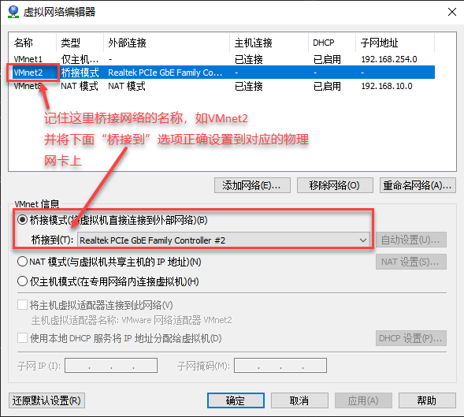
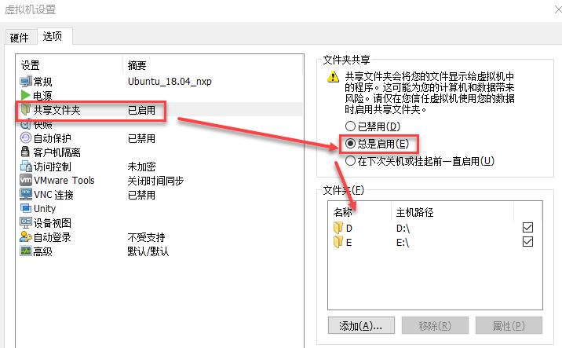

# Linux技术培训 - 基础操作及全命令行工作

- [Linux技术培训 - 基础操作及全命令行工作](#linux%e6%8a%80%e6%9c%af%e5%9f%b9%e8%ae%ad---%e5%9f%ba%e7%a1%80%e6%93%8d%e4%bd%9c%e5%8f%8a%e5%85%a8%e5%91%bd%e4%bb%a4%e8%a1%8c%e5%b7%a5%e4%bd%9c)
  - [目标](#%e7%9b%ae%e6%a0%87)
  - [参考资料](#%e5%8f%82%e8%80%83%e8%b5%84%e6%96%99)
  - [学习内容](#%e5%ad%a6%e4%b9%a0%e5%86%85%e5%ae%b9)
    - [1.系统安装](#1%e7%b3%bb%e7%bb%9f%e5%ae%89%e8%a3%85)
      - [软件要求](#%e8%bd%af%e4%bb%b6%e8%a6%81%e6%b1%82)
      - [安装要点](#%e5%ae%89%e8%a3%85%e8%a6%81%e7%82%b9)
      - [善用Tab键](#%e5%96%84%e7%94%a8tab%e9%94%ae)
      - [安装VMWare Tools](#%e5%ae%89%e8%a3%85vmware-tools)
    - [2.配置IP地址](#2%e9%85%8d%e7%bd%aeip%e5%9c%b0%e5%9d%80)
      - [准备上网环境](#%e5%87%86%e5%a4%87%e4%b8%8a%e7%bd%91%e7%8e%af%e5%a2%83)
    - [3.安装软件](#3%e5%ae%89%e8%a3%85%e8%bd%af%e4%bb%b6)
    - [4.通过SSH连接虚拟机](#4%e9%80%9a%e8%bf%87ssh%e8%bf%9e%e6%8e%a5%e8%99%9a%e6%8b%9f%e6%9c%ba)
      - [虚拟机服务安装](#%e8%99%9a%e6%8b%9f%e6%9c%ba%e6%9c%8d%e5%8a%a1%e5%ae%89%e8%a3%85)
      - [Windows客户端](#windows%e5%ae%a2%e6%88%b7%e7%ab%af)
    - [5.学习命令](#5%e5%ad%a6%e4%b9%a0%e5%91%bd%e4%bb%a4)
    - [6.学习vim](#6%e5%ad%a6%e4%b9%a0vim)
    - [7.命令行编译C程序](#7%e5%91%bd%e4%bb%a4%e8%a1%8c%e7%bc%96%e8%af%91c%e7%a8%8b%e5%ba%8f)
    - [8.压缩解压文件](#8%e5%8e%8b%e7%bc%a9%e8%a7%a3%e5%8e%8b%e6%96%87%e4%bb%b6)
    - [9.命令行进阶-管道的使用（grep）](#9%e5%91%bd%e4%bb%a4%e8%a1%8c%e8%bf%9b%e9%98%b6-%e7%ae%a1%e9%81%93%e7%9a%84%e4%bd%bf%e7%94%a8grep)
    - [10.命令行进阶-xargs的使用（find）](#10%e5%91%bd%e4%bb%a4%e8%a1%8c%e8%bf%9b%e9%98%b6-xargs%e7%9a%84%e4%bd%bf%e7%94%a8find)
    - [11.命令行进阶-awk和sed](#11%e5%91%bd%e4%bb%a4%e8%a1%8c%e8%bf%9b%e9%98%b6-awk%e5%92%8csed)
      - [例子1：awk分割字符串提取指定列的信息](#%e4%be%8b%e5%ad%901awk%e5%88%86%e5%89%b2%e5%ad%97%e7%ac%a6%e4%b8%b2%e6%8f%90%e5%8f%96%e6%8c%87%e5%ae%9a%e5%88%97%e7%9a%84%e4%bf%a1%e6%81%af)
      - [例子2：sed实现字符串查找替换](#%e4%be%8b%e5%ad%902sed%e5%ae%9e%e7%8e%b0%e5%ad%97%e7%ac%a6%e4%b8%b2%e6%9f%a5%e6%89%be%e6%9b%bf%e6%8d%a2)
    - [12.自定义shell环境](#12%e8%87%aa%e5%ae%9a%e4%b9%89shell%e7%8e%af%e5%a2%83)
    - [13.PATH环境变量](#13path%e7%8e%af%e5%a2%83%e5%8f%98%e9%87%8f)
      - [PATH变量是什么](#path%e5%8f%98%e9%87%8f%e6%98%af%e4%bb%80%e4%b9%88)
      - [如何追加一个PATH路径](#%e5%a6%82%e4%bd%95%e8%bf%bd%e5%8a%a0%e4%b8%80%e4%b8%aapath%e8%b7%af%e5%be%84)
  - [阶段测试](#%e9%98%b6%e6%ae%b5%e6%b5%8b%e8%af%95)
    - [命令行练习1：文件操作](#%e5%91%bd%e4%bb%a4%e8%a1%8c%e7%bb%83%e4%b9%a01%e6%96%87%e4%bb%b6%e6%93%8d%e4%bd%9c)
    - [命令行练习2：vim基本操作](#%e5%91%bd%e4%bb%a4%e8%a1%8c%e7%bb%83%e4%b9%a02vim%e5%9f%ba%e6%9c%ac%e6%93%8d%e4%bd%9c)
    - [命令行练习3：压缩解压文件](#%e5%91%bd%e4%bb%a4%e8%a1%8c%e7%bb%83%e4%b9%a03%e5%8e%8b%e7%bc%a9%e8%a7%a3%e5%8e%8b%e6%96%87%e4%bb%b6)
    - [命令行练习4：统计目录大小](#%e5%91%bd%e4%bb%a4%e8%a1%8c%e7%bb%83%e4%b9%a04%e7%bb%9f%e8%ae%a1%e7%9b%ae%e5%bd%95%e5%a4%a7%e5%b0%8f)
    - [命令行练习5：grep+awk组合练习](#%e5%91%bd%e4%bb%a4%e8%a1%8c%e7%bb%83%e4%b9%a05grepawk%e7%bb%84%e5%90%88%e7%bb%83%e4%b9%a0)

## 目标

掌握Linux系统命令行的基本操作方法和进阶的部分技巧
最终达到能够在纯命令行的环境下，完成日常程序开发的水平

## 参考资料

**TODO** `具体章节待定`

**基本入门：**
《鸟哥的私房菜 服务器版》 从系统安装到基本的PC系统使用介绍，推荐0基础学习
**一个GitHub上注明的命令行教程：**
[https://github.com/jlevy/the-art-of-command-line/blob/master/README-zh.md](https://github.com/jlevy/the-art-of-command-line/blob/master/README-zh.md)
经典命令行技巧汇总，强烈推荐
**工具书**
《Linux命令行与shell脚本编程大全》

前几章内容同样适合入门，介绍纯命令行的操作
后续shell脚本编程等会持续用到该书

## 学习内容

### 1.系统安装

参考网上的文档，在虚拟机中安装Ubuntu系统，用于系统学习和后续的课程。<br>
相关软件包在部门NAS服务器中均可以下载到，使用SVN账号密码登陆：<br>
[深圳NAS服务器 ftp://nas-wh.cet-dev.org](ftp://nas-sz.cet-dev.org/)<br>
[武汉NAS服务器 ftp://nas-wh.cet-dev.org](ftp://nas-wh.cet-dev.org/)<br>

#### 软件要求

* VMWare Workstation 14.0&nbsp;&nbsp;&nbsp;&nbsp;`/Software/系统盘及常用软件/Linux安装盘/`
* Ubuntu Server 18.04.1 64bit&nbsp;&nbsp;&nbsp;&nbsp;`/Software/系统盘及常用软件/VMWare虚拟机/`
* SSH工具：MobaXterm&nbsp;&nbsp;&nbsp;&nbsp;`/Software/调试工具/`

#### 安装要点

* 我们采用服务器版系统，不带桌面环境，只能命令行操作，便于养成全命令行操作的习惯
* VMWare设置要点：
  * 如电脑具有两块物理网卡，请在虚拟机中添加两块网卡。其中第一块使用NAT模式，用于和Windows系统互联；第二块使用桥接模式，用于后续实验中与装置互联，需要在VMWare的`编辑-虚拟网络编辑器`中，指定桥接网卡对应的物理网卡：<br>
  
  * 虚拟机硬件配置，CPU推荐单CPUN核，与实际物理核心数移植；内存推荐2-4GB；硬盘推荐40GB+
  * 在`虚拟机-设置-选项`中，启用`共享文件夹`功能，并将主机中`D:`、`E:`等盘符共享至虚拟机：<br>
  
* 系统安装要点：
  * 硬盘分区采用默认设置
  * IP地址先采用默认设置
  * 选择服务器安装类型时，不选择直接下一步跳过，进行最小安装
  * 设置一个较简单的如`ceiec`的密码，方便后面经常使用`sudo`输入
  
#### 善用Tab键

Linux中，命令行shell普遍具有代码/路径自动提示功能，遇到很长不好输入的路径/文件名，遇到记不住的命令，都可以经常使用`TAB`键进行提示。按一下`TAB`没反应，按两下出现所有匹配。
`TAB`键是Linux用户除了空格和回车外使用最频繁的按键，一定一定要养成使用`TAB`键代替自己手动逐个字符输入的**好习惯**。

#### 安装VMWare Tools

VMWare Tools是安装在虚拟机中的VMWare驱动和工具，用于改善虚拟机性能、实现虚拟机和宿主机的文件共享等功能。考虑到本阶段学员的命令行水平还很低，直接给出安装流程。<br>
首先在VMWare中，点击`虚拟机 - 重新安装VMWare Tools...`，接着在虚拟机内，执行如下命令进行安装：

``` sh
# 创建一个/mnt/cdrom目录用于挂载光驱
sudo mkdir /mnt/cdrom
# 挂载光驱到/mnt/cdrom目录
sudo mount -t iso9660 /dev/cdrom /mnt/cdrom
# 复制安装包到当前用户home目录，解压并进入该目录
cp VMwareTools-10.2.0-7259539.tar.gz ~
cd ~
tar xzvf VMwareTools-10.2.0-7259539.tar.gz
cd vmware-tools-distrib/
# 启动安装
sudo ./vmware-install.pl
# 后面所有提示问题，全部按回车确认，直到安装结束
# ls查看/mnt/hgfs目录，如存在上面VMWare虚拟机中配置的文件夹共享盘符
# 我们认为VMWare Tools安装成功
ls /mnt/hgfs
```

### 2.配置IP地址

系统安装后，应能正常登陆。接下来要做的第一步是配置IP地址，让虚拟机能够上网。<br>
上网是安装必备软件的基本要求，如不能上网，采用离线cd安装，可能会有各种坑，暂不采用这种方式。

#### 准备上网环境

Linux是一个开源的操作系统，是基于互联网进行广泛的全球合作的产物。安装下载软件需要网络，学习资料来源于网络，权威文档来源于网络。故我们在学习、使用Linux系统时，互联网的连接是必不可少的。没有网络，我们的学习效率、工作效率都会受到极大的影响。<br>
**联系网管，或自行通过上网机桥接等方式，创造一个能上外网的环境。**

* 建议1：双网卡上网，通过第二张`桥接网卡`与上网机/路由器连接，实现上网
* 建议2：宿主机通过各种办法上网后，通过第一张`NAT网卡`，虚拟机自然可以上网
* 建议3：单网卡，虚拟机单网卡使用桥接模式，与唯一物理网卡绑定，将上网路由器、宿主机、虚拟机设置在同一个私有子网地址下，实现上网和与宿主机通讯两不误

建立正确的上网条件后，可以开始设置虚拟机ubuntu系统的IP地址。

* 方案1: 宿主机能上网，双网卡。第一张网卡NAT共享宿主机的外网，使用DHCP自动获取IP；第二张桥接网卡专门和装置连接，使用静态IP地址
* 方案2：宿主机能上网，单网卡。NAT模式共享宿主机的外网，Linux系统内单一网卡，使用静态IP模式设置两个IP
* 方案3：宿主机不能上网，通过双网卡桥接网卡上网。第一张网卡NAT模式，使用静态IP地址（192.168.10.xxx），用于和宿主机连接；第二张桥接网卡负责上外网和装置连接，使用静态IP地址，设置默认路由。
* 方案4：宿主机不能上网，通过桥接模式和物理网卡连接。路由器、宿主机、虚拟机均使用静态IP地址，一个网卡设置多个IP，实现上内网，上外网，连装置的功能。（推荐）

Ubuntu 18 Server版，网络参数配置使用了`netplan`程序进行管理。
这里有一篇比较完整介绍`netplan`的文章，推荐阅读：<br>
[https://linux.cn/article-10095-1.html?pr](https://linux.cn/article-10095-1.html?pr)<br>
对于`netplan`我们要注意几点：

* 在系统学习Linux下最强大的文本编辑器vim前，我们推荐使用内置的简单编辑器`nano`进行文本编辑。`nano`界面下方有命令提示，如`^X Exit`，其中`^`是CTRL键的简写
* 编辑配置文件应采用`sudo`使用管理员权限执行，如
  
``` sh
sudo nano /etc/netplan//etc/netplan/50-cloud-init.yaml
```

* 配置文件采用的yaml格式，是近年来继json后的另一种标记描述语言，用于配置文件、描述文件很合适，有兴趣的可以进一步了解一下
* 修改完yaml文件后，使用`sudo netplan apply`命令使配置生效
* 使用`ip a`或`ifconfig`查看IP地址
* 使用`route -n`查看`0.0.0.0`对应的网关来确定默认网关配置
* 系统DNS服务器地址在yaml里设置，已无法在`/etc/resolve.conf`文件中看到

配置IP地址是使用Ubuntu系统的第一步，系统使用也不熟悉，可能碰到很多困难，需要上网搜索、自己研究解决客服。

### 3.安装软件

Ubuntu系统采用`apt-get`工具进行软件安装，系统自动从网络上的软件仓库获取软件，自动安装到系统。相比二十年前的纯手动软件安装来说，已经极其简单了。安装软件的过程通常可以分为如下几个步骤：

``` sh
sudo nano /etc/apt/source.list  # 编辑软件更新源列表，通常我们将其改为阿里云服务器
sudo apt-get update             # 从服务器拉取最新的软件包列表
sudo apt-get install vim        # 安装vim编辑器
# 后续安装其他软件，一般不需要执行前两步，除非更新了源地址
```

学会了安装软件的方法，你可以在Linux世界里畅游了。我们后面的开发、编译，同样需要大量的第三方软件的支撑。

### 4.通过SSH连接虚拟机

SSH是Linux系统下的加密远程终端，可以提供加密的数据通道、文件传输通道、端口透传、图形界面透传等大量的功能。

#### 虚拟机服务安装

服务器版的Ubuntu Server系统已经预装了OpenSSH Server软件，我们可以直接使用。
通过`netstat -ant`命令，确认是否有`0.0.0.0:22`的监听端口，可以确认SSH Server服务的状态。
如没有，可通过`sudo apt-get install openssh-server`命令安装服务。

#### Windows客户端

Windows下有大量的SSH客户端，比如SecureCRT、Putty，但这里强烈推荐采用的是MobaXterm软件。原因不多说，就是功能强大，且支持语法高亮显示，非常适合日常高强度的命令行远程操作。<br>
软件连接服务器后，提示输入用户名和密码，成功登陆后，除了出现Shell提示符外，软件左侧还提供了基于SFTP协议的文件传输服务，也可以很方便地进行日常文件下载、上传操作。

### 5.学习命令

Linux日常使用的命令不多，通过日常的强制性练习，杜绝使用图形界面，通常在几天内可以形成初步的习惯，在高强度的使用一个月左右，可以完全入门达到熟练应用的程度。<br>
推荐的学习书籍包括：《鸟哥的私房菜 服务器版》、《Linux命令行与Shell脚本编程》等，同时最重要最方便的资料，有两个，比翻书更快：

1. 互联网
2. man和help

遇到日常操作不清楚的，直接上网搜索即可（这也是为什么Linux学习前期需要方便的上网环境的原因之一）。同时还有Linux内置的方便的帮助系统：`man`命令和`--help`参数，任何命令都提供了`--help`的参数，可以方便快速的查看命令的使用方法。如果想进一步了解细节和范例，通过`man <command>`命令可以查阅详细的命令手册（**Man**ual）<br>
Linux基本命令分为如下几大类：

* 目录管理、文件复制和移动 ls、cd、cp、rm、mkdir、rmdir……
* 搜索文件和内容 find、grep（重要）
* 文件查看和编辑 cat、vi/vim、head、tail
* 磁盘空间和文件夹统计等 df、du
* 权限相关操作 chmod、chown
* 查看和调用历史命令 history、!
* 后台任务管理相关 Ctrl-Z、bg、fg

上述命令，请在系统阅读《鸟哥私房菜》、《Linux命令行》等书籍后，通过多多练习，达到记忆、熟练、条件反射的程度。

### 6.学习vim

`vi`是世界上最强大的编辑器，甚至超过图形界面的各种编辑器。而且任何Linux系统都包含了这个工具，包括我们的嵌入式Linux系统，只有`vi`这一个编辑器，非用不可。掌握`vi`是熟练掌握Linux系统使用的一个门槛，在中电属于必须掌握的内容。<br>
`vi`的使用非常复杂，完全基于各种命令和按键，使用不容易，但是我们日常用来快速修改代码、阅读代码、修改配置文件等简单操作，实际使用的命令很有限，其他复杂内容完全可以用到了上网查。所以不要被吓到。<br>

通常我们使用如下教程作为`vi`的入门，大量的命令请跟着教程逐个自己试用、验证，不能只看不练。<br>
<https://www.runoob.com/linux/linux-vim.html><br>
在vi中我们日常开发用到的指令有如下几种，请重点学习掌握：

* 光标移动类 j k h l 对应上下左右，实际用方向键也无妨
* 插入命令 i shift-A
* 退出、保存退出、强制退出 :q :wq :q!
* 删除和剪切 x dd 3d
* 复制 yy 3y
* 粘贴剪切板上的内容 p
* 快速跳转行号及调到结尾开头 :123 G gg
* 查找及下一个 / n N
* 快速查找光标单词 # *

只要记住上面这些指令，通过日常反复强迫自己使用`vi`而不是`nano`，通常很快可以克服恐惧，形成习惯，高强度使用一个月左右，就可以感受到`vi`的方便性。

### 7.命令行编译C程序

目前我们还没有在系统中安装任何交叉编译器，但Ubuntu系统提供x86_64系统的原生编译器`gcc`，可以做一些基本的命令行程序开发工作，熟悉命令行编译和开发的过程。<br>
使用`gcc --version`命令来确认我们系统中是否安装了`gcc`，同时确认`gcc`版本。<br>
请编写一个最简单的hello world程序，来体验命令行手工编译程序的过程：

``` sh
mkdir ~/c-test
cd ~/c-test
vi hello.c
# 开始编译程序
gcc -o hello hello.c
# 执行编译出来的二进制程序
# 要调用当前目录下的程序，需要加'./'前缀，表示当前目录
./hello
# 查看这个二进制程序的文件头类型
file hello
```

命令行的编译单个文件很简单，如果编译多个文件，也可以，但通常采用`Makefile`的方式构建`工程`，这也是GNU Linux体系中最常用的程序构建方法。具体的方法我们会在后面的课程中具体研究，这里我们只做一次简单的体验。

``` sh
# 下载和解压源码
cd ~/c-test
wget -O libhiredis.zip https://codeload.github.com/redis/hiredis/zip/master
unzip libhiredis.zip
cd hiredis-master
# 使用make编译，命令会自动在当前目录下查找Makefile，并按照配置自动构建程序
make
# 查看该工程编译输出的文件，一个so动态链接库
ls *.so
```

### 8.压缩解压文件

在上面的几个例子里，我们已经碰到了tar.gz、zip两种压缩包的解压操作。Linux下开发我们经常会遇到压缩文件、解压文件的操作。最简单的方式是遇到什么压缩包，我们上网搜索，找到对应的解压命令即可。但对于常见的压缩包类型，如果我们能记忆命令，操作效率会大大提升。常见的操作命令有如下几种，请查阅资料，找到对应的压缩包的压缩和解压过程，进行实践操作，将对应的命令填写在下表中：

|  压缩格式 | 压缩命令&nbsp;&nbsp;&nbsp;&nbsp;&nbsp;&nbsp;&nbsp;&nbsp;&nbsp;&nbsp;&nbsp;&nbsp;&nbsp;&nbsp;&nbsp;&nbsp;&nbsp;&nbsp;&nbsp;&nbsp;&nbsp;&nbsp;&nbsp;&nbsp;&nbsp;&nbsp;&nbsp;&nbsp;&nbsp;&nbsp;&nbsp;&nbsp;&nbsp;&nbsp;&nbsp;&nbsp;&nbsp;&nbsp;&nbsp;&nbsp;&nbsp;&nbsp;  | 解压命令&nbsp;&nbsp;&nbsp;&nbsp;&nbsp;&nbsp;&nbsp;&nbsp;&nbsp;&nbsp;&nbsp;&nbsp;&nbsp;&nbsp;&nbsp;&nbsp;&nbsp;&nbsp;&nbsp;&nbsp;&nbsp;&nbsp;&nbsp;&nbsp;&nbsp;&nbsp;&nbsp;&nbsp;&nbsp;&nbsp;&nbsp;&nbsp;&nbsp;&nbsp;&nbsp;&nbsp;&nbsp;&nbsp;&nbsp;&nbsp;&nbsp;&nbsp;&nbsp;&nbsp;&nbsp;&nbsp; |
|---|---|---|
|  `tar.gz` |   |   |
|  `tar.bz` |   |   |
|  `tar.bz2` |   |   |
|  `tar.xz` |   |   |
|  `tar` |   |   |
|  `zip` |   |   |
|   |   |   |

### 9.命令行进阶-管道的使用（grep）

请阅读参考书籍中关于`管道`、`grep`命令的内容，并通过下面的例子进行实践和巩固：

``` sh
# 请通过ssh上传一份C代码，如main.c

# 列出该c文件中引用的头文件
grep '#include' main.c

##############################
# libhiredis是高性能内存数据库Redis的C语言客户端函数库
# 我们来看看这个工程里如何使用select来处理网络连接的
# 使用grep来搜索libhiredis项目源码中所有调用系统select()
# 遍历子目录，同时结果输出带行号
cd ~/c-test/hiredis-master
grep select * -Rn
# 我们发现在CHANGELOG.md文件中，有说到select()已经不再使用
# 转而使用poll()，用来支持连接数>1024的情况
# 我们再搜索一下poll：
grep poll * -Rn
# 结果有点多，还包含了很多xxx->poll_fd，不是我们想要的
# 修改关键字
grep poll( * -Rn
# OOPS 报错了，再修改一下
grep 'pool(' * -Rn
# 现在好多了，所有调用poll函数的位置都显示出来了
# 同时结果里也有行号，我们用vi进去看
# 这次直接跳转到对应的行号
vi net.c +246
###############################

# 通过命令+管道，实现命令结果的过滤
# 显示所有连接tcp 22端口（即ssh）的客户端情况
netstat -ant | grep :22
# 这个结果里还包含两个服务器监听端口，通过表格最后ESTABLISHED可以区分
# 再改进一下
netstat -ant | grep :22 | grep ESTAB
# Done!

###############################
# ps命令是Linux里的任务管理器
# ps -aux可以显示系统中所有的任务
ps -aux
# 返回结果很多
# 使用grep筛选系统中所有和ssh相关的进程
ps -aux | grep ssh

```

### 10.命令行进阶-xargs的使用（find）

本节有两个知识点

1. find命令用于搜索特定文件的方法
2. 使用xargs命令将上一条命令的结果传给下一个，与管道|的区别

我们再通过一个例子来练习，同时请自己设计一些应用场景，举一反三

``` sh
cd /
# 使用find查找系统/etc目录下的conf后缀的文件
find /etc -name '*.conf'
# 使用du来显示一个文件大小
du /bin/bash
# 将find输出的文件列表，转给du来显示文件大小
find /etc -name '*.conf' | du
# OOPS 输出结果不正确，du输出的文件根本不是我们刚搜出来的.conf
# 说明管道操作 | 对du无效，du不接受管道输入
# 我们换用xargs作为中间转发器
find /etc -name '*.conf' | xargs du
# 这下就对了，xargs能从|管道中读取数据，然后把结果通过命令参数的方式
# 传递给下一个不支持管道、但支持参数输入的命令
```

### 11.命令行进阶-awk和sed

关于awk和sed两个命令，有人写了整整一本书来介绍。

这两个命令加上正则表达式的应用，已经不能用命令来描述了，有人把这两个东西称之为一门编程语言！这也正是Linux系统的能吸引世界上最顶级IT人才的独一无二的魅力。<br>
当然，我们根本不需要了解这些东西，只需要做几个简单的练习，在以后的开发中，遇到一些需要自动化脚本实现复杂功能的时候，能想起来有这么一个强大的瑞士军刀，能解决你的问题就够了。

#### 例子1：awk分割字符串提取指定列的信息

`ls -l`命令可以列出当前目录下的文件详情：

``` sh
cet@cet-dev:~/c-test/hiredis-master$ ls -l
total 2232
drwxrwxr-x 2 cet cet   4096 Apr 13 13:16 adapters
-rw-rw-r-- 1 cet cet    743 Apr 13 13:16 appveyor.yml
-rw-rw-r-- 1 cet cet  28492 Apr 13 13:16 async.c
-rw-rw-r-- 1 cet cet   5732 Apr 13 13:16 async.h
-rw-rw-r-- 1 cet cet 150488 Aug  1 08:39 async.o
```

如果我们只想要显示权限+文件名，该怎么办？<br>
通过`ls --help`没找到对应的参数，我么可以用awk来完成这个任务。<br>
awk的作用，是对输入的字符串，按照指定的分割规则，进行**切片**分列，然后按指定的格式输出。

``` sh
# 现在我们先输出一次原始的ls -l
cd ~/c-test/hiredis-master
ls -l
# 使用awk自动分列
# awk的最基本用法格式：awk -F <分隔符> '{print $x}' FILE
# 使用' '空格作为分隔符，并输出第一列
ls -l | awk -F ' ' '{print $1}'
# 权限列表被打印出来了
# 打印前两列
ls -l | awk -F ' ' '{print $1,$2}'
# 打印第一列+最后一列，用到了$NF这个关键字，特指最后一列
ls -l | awk -F ' ' '{print $1,$NF}'
# 打印第一列+倒数第二列+最后一列
ls -l | awk -F ' ' '{print $1,$(NF-1),$NF}'
```

大概用到这样，就够了。能了解awk能实现excel中导入外部数据，并根据分隔符进行自动分列即可。后面我们也有联系可以帮助巩固知识。

#### 例子2：sed实现字符串查找替换

我们在word或其他任务GUI界面的编辑器里，都可以轻松实现查找替换。当然在vi中，也可以轻松查找替换。但是如果通过shell，需要自动化的进行文件内容的查找替换，该如何实现呢？

答案是使用sed命令。<br>

sed提供了一条命令直接完成文件内容查找替换的功能，在一些需要通过shell脚本完成大批量文件的查找替换，或者需要非人工干预的自动流程中实现修改文件内容操作的场合，大有用处。<br>
这里有个典型的用法，在一些自动化编译的场景下，需要通过shell脚本自动完成git下载源码后自动编译二进制文件，如果下载的源码中我们需要手动修改比如Makefile中的一个程序安装目录，或者编译参数，应该怎么办呢？<br>
在单次的手工编译时，我们用vi可以轻松完成任务。如果这个任务是全自动执行的，每天定时编译代码，每次下载新的代码都需要覆盖旧代码，上次手工修改的文件无法保存下来，这就需要把修改源文件的过程自动化。sed就是用来干这个的。

例子：在自动编译SSL加密库mbedtls时，我们需要修改Makefile中的一行代码

``` Makefile
DESTDIR=/usr/local
==>
DESTDIR?=/usr/local
```

使用sed如何完成？一条命令搞定

``` sh
# sed 's/要被取代的字串/新的字串/g'
# 参数 -i表示修改后的内容直接替代原文件否则只会在shell中输出替换后的文件内容
sed -i 's/DESTDIR=/DESTDIR?=/g' Makefile
```

### 12.自定义shell环境

通过上面各种案例的练习，我们已经掌握了很多命令的使用，也发现一些命令通过添加一些参数可以变得更好用，比如：

``` sh
# ls -lh 比 ls -l 显示文件大小更加友好
# grep -n可以额外显示关键字命中的行号，方便我们进一步定位
# du -h 比 du显示文件大小更加友好
```

为了偷懒方便，shell为我们提供了一些自定义Bash环境的方法。一个典型的方法是`alias`命令别名，通过别名功能，我们可以简化繁琐的参数输入，举例说明：

```sh
alias ll='ls -alh'      # 使用ll来代替ls -lha显示隐藏文件且文件大小用KB、MB
alias l='ls'            # l代替ls，少输入一个字符
alias grep='grep -n'    # grep默认带行号
alias du='du -h'        # du默认带MB、KB单位
```

同时Bash等shell均提供了一个配置脚本，每次打开一个新的终端，该配置脚本中的代码都会自动加载执行。这个文件在每个用户home目录下，是一个隐藏文件（以.开头）`.bashrc`

``` sh
# 使用>>不用vi直接向已有文件尾部追加内容，注意是两个>，一个>会删除文件原有内容
echo alias ll='ls -alh' >> ~/.bashrc
echo alias l='ls' >> ~/.bashrc
echo alias grep='grep -n' >> ~/.bashrc
echo alias du='du -h' >> ~/.bashrc
```

### 13.PATH环境变量

我们说到`.bashrc`文件，不可避免的谈到`PATH`环境变量的问题。

#### PATH变量是什么

简单说`PATH`就是一组路径的字符串变量，当你输入的命令不带任何路径时，Linux会在`PATH`记录的路径中查找该命令。有的话则执行，不存在则提示命令找不到。<br>
比如在根目录`/`下可以输入命令`ls`，在`/usr`目录下也可以输入`ls`，但其实`ls`命令根本不在这个两个目录下，当你输入`ls`命令时Linux会去`/bin`，`/usr/bin`，`/sbin`等目录寻找该命令。而`PATH`就是定义`/bin:/sbin:/usr/bin`等这些路劲的变量，其中冒号为目录间的分割符。

#### 如何追加一个PATH路径

**场景**<br>
当我们自己写了一个脚本，或者把一个程序安装到某个目录后，通过shell调用该程序，报错提示不存在该命令，除了命令输入错误外，通常就是PATH路径的问题了。<br>
Shell没有在PATH环境变量指向的所有目录中找到你输入的程序，所以报错。<br>
我们要做的是，将新安装的程序所在目录加入到PATH环境变量中。

``` sh
# 先看一下目前PATH变量的值
# Linux Shell中引用一个变量需要在前面加$
echo $PATH
# 在现有的PATH基础上，追加一个路径
PATH=/the/new/path:$PATH
# 上面的命令执行后，只在当前shell进程中有效
# 一旦退出、注销、重新连接一个新shell，PATH还是原来的
# 通过在.bashrc中添加一条自动执行的，修改PATH变量的语句，可以永久生效
# 这里同样用echo >>代替vi修改文件，方便演示
echo export PATH=/the/new/path:$PATH >> ~/.bashrc
# 配置文件要生效，需要退出当前shell重新登录
exit
# 或者不退出，执行以下语句
source ~/.bashrc
# 这时候我们再执行以下刚才无法执行的程序，看看是否生效
# 或者打印以下PATH变量
echo $PATH
```

## 阶段测试

### 命令行练习1：文件操作

使用命令行完成如下工作：

1. 从[官网 http://redis.io](http://redis.io) 下载redis源码，使用curl命令下载
2. 解压代码后，将`src`目录单独复制出来
3. 使用`find`命令搜索其中以redis开头的c文件，利用管道`|`、`xargs`等工具，**一次性、一条指令**复制到另一个目录中
4. 将提取出来的redis开头的文件，打包成`my-redis.tar.gz`。要求压缩包结构如下：

请列出完成上述操作依次需要执行的指令，要求指令越简单、步骤越少越好

### 命令行练习2：vim基本操作

使用vim完成如下操作：

1. 打开redis软件包中redis.conf文件
2. 使用`/`命令搜索关键字daemonize
3. 使用`i`进入INSERT模式，修改该参数为yes
4. 继续搜索requirepass参数，在命令模式下，使用复制一行的命令将改配置复制一行
5. 使用`x`命令取消新复制的参数的注释，并将`<password>`值改为ceiec
6. 尝试使用VISUAL LINE模式，进行大块代码的复制、删除操作：体会`v`指令、`shift-V`指令的区别，配合`d`、`y`、`p`命令，实现一大块内容的复制、剪切、粘贴
7. 最后保存文件退出

**要求：后续所有命令行的操作，源码的修改，都要求强制使用vim。**<br>
**通过一段时间的强制使用，可以达到很高的熟练度、形成习惯**

### 命令行练习3：压缩解压文件

请完成课程中不同压缩格式的压缩解压命令，填入表格中。

|  压缩格式 | 压缩命令&nbsp;&nbsp;&nbsp;&nbsp;&nbsp;&nbsp;&nbsp;&nbsp;&nbsp;&nbsp;&nbsp;&nbsp;&nbsp;&nbsp;&nbsp;&nbsp;&nbsp;&nbsp;&nbsp;&nbsp;&nbsp;&nbsp;&nbsp;&nbsp;&nbsp;&nbsp;&nbsp;&nbsp;&nbsp;&nbsp;&nbsp;&nbsp;&nbsp;&nbsp;&nbsp;&nbsp;&nbsp;&nbsp;&nbsp;&nbsp;&nbsp;&nbsp;  | 解压命令&nbsp;&nbsp;&nbsp;&nbsp;&nbsp;&nbsp;&nbsp;&nbsp;&nbsp;&nbsp;&nbsp;&nbsp;&nbsp;&nbsp;&nbsp;&nbsp;&nbsp;&nbsp;&nbsp;&nbsp;&nbsp;&nbsp;&nbsp;&nbsp;&nbsp;&nbsp;&nbsp;&nbsp;&nbsp;&nbsp;&nbsp;&nbsp;&nbsp;&nbsp;&nbsp;&nbsp;&nbsp;&nbsp;&nbsp;&nbsp;&nbsp;&nbsp;&nbsp;&nbsp;&nbsp;&nbsp; |
|---|---|---|
|  `tar.gz` |   |   |
|  `tar.bz` |   |   |
|  `tar.bz2` |   |   |
|  `tar.xz` |   |   |
|  `tar` |   |   |
|  `zip` |   |   |
|   |   |   |

### 命令行练习4：统计目录大小

du命令可以查看目录及其子目录的磁盘占用情况，请利用du命令的各种参数，配合sort、head等命令，实现一条指令列出当前目录下磁盘占用前3的子目录。<br>
上述命令，可以在vmware安装包解压目录`~/vmware-tools-distrib`下执行。

### 命令行练习5：grep+awk组合练习

系统`/proc`目录，是Linux的重要目录，内部文件都是虚拟的文件节点，为用户提供了系统状态信息。其中`/proc/cpuinfo`提供了系统的CPU信息，通过`cat /proc/cpuinfo`可以显示文件内容
请通过命令行完成如下操作：

1. 通过`grep`、`count`等命令组合，通过统计CPU信息出现的次数，一条命令获取该系统的CPU核心数量
2. 通过`grep`、`awk`命令组合，通过提取其中cpu cores关键字的方式，一条命令获取CPU的核心数量
3. 通过`grep`、`awk`等命令组合，通过提取model name后的关键字的方式，一条命令提取每个CPU的GHz主频

请列出完成上述操作依次需要执行的指令，要求每个功能一条命令完成所有操作，最终输出结果只有一个数字，不能有其他任何不相关的字符、空格等
