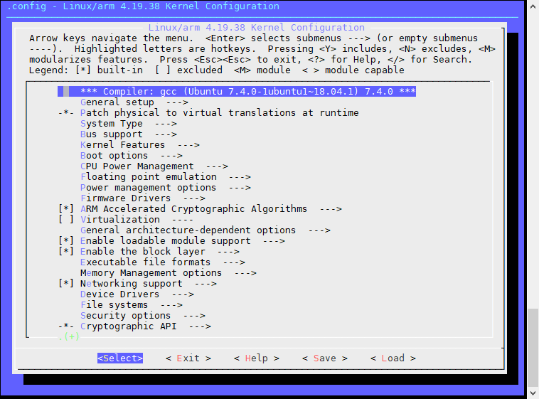

# Linux技术培训 - 内核基础

## 目标

本章节通过一系列案例，为Linux应用程序开发人员普及基础的Kernel知识和概念，使之对Linux系统的底层原理和开发过程有个全局的认识。有利于未来开发项目时，更好地和内核开发工程师进行高效沟通。

## 参考资料

* [TI Processor SDK Linux Software Developer’s Guide](http://software-dl.ti.com/processor-sdk-linux/esd/docs/06_00_00_07/linux/index.html)

## 学习内容

### 开发环境配置

上一章我们在Ubuntu系统中使用gcc进行了第一次程序编译，这是原生编译（即在x86_64主机上编译开发x86_64程序），非交叉编译（在x86_64主机上编译开发ARM程序）。对于交叉编译，我们还需要专用的交叉编译器，如arm-linux-gnueabihf-gcc等。同时除了gcc，开源软件还使用了大量自动化工具来增强程序跨平台编译的能力，我们编译这类软件还需要额外的工具软件。<br>

#### 安装编译工具和软件

首先安装一些调试和编译内核需要使用的基本软件，包括编译工具、tftp和nfs server等。同时还要安装SDK文件

``` sh
# 安装编译工具
sudo apt-get install build-essential libtool autotools-dev automake pkg-config zip bison libssl-dev
sudo apt-get install nfs-server tftpd-hpa
sudo apt-get libncurses5-dev
# 安装TI SDK
# 假设安装包在Windows宿主机的D盘根目录，我们在上一章已经通过安装VMWare Tools
# 把D盘共享到Linux系统中，所以我们进入/mnt/D目录可以直接访问到文件
cd /mnt/D
./ti-processor-sdk-linux-am335x-evm-06.00.00.07-Linux-x86-Install.bin
# 注意这个安装包是图形界面，通过MobaXterm软件可以重定向X11图形到远程主机
# 请注意是否有新弹出的mobaXterm软件窗口，找到并下一步安装即可
# 安装目标路径推荐: /home/<usr>/ti-processor-sdk-.....

# 完成后，因为sdk的路径名很长，我们做一个符号链接，简化后续路径输入
# 将sdk安装目录链接到~/sdk
cd ~
ln -s ti-processor-sdk-linux-am335x-evm-06.00.00.07/ ~/sdk
ls -l
# 可以看到sdk目录指向真正的sdk根目录
total 20
drwxrwxr-x 3 cet cet 4096 Aug  1 08:39 c-test
lrwxrwxrwx 1 cet cet   46 Aug  2 03:05 sdk -> ti-processor-sdk-linux-am335x-evm-06.00.00.07/
drwxrwxr-x 2 cet cet 4096 Aug  2 02:14 tftpboot
drwxrwxr-x 8 cet cet 4096 Aug  2 02:24 ti-processor-sdk-linux-am335x-evm-06.00.00.07
```

#### 配置tftp服务

``` sh
# 安装配置tftp
mkdir ~/tftpboot    #创建tftp根目录
sudo vi /etc/default/tftpd-hpa
```

修改`/etc/default/tftpd-hpa`的配置

``` sh
# /etc/default/tftpd-hpa

TFTP_USERNAME="cet" #这里写用户名
TFTP_DIRECTORY="/home/cet/tftpboot" #tftp根目录
TFTP_ADDRESS="0.0.0.0:69"
TFTP_OPTIONS="-l -s"
```

修改完后，重启tftp服务

```sh
# 重启tftp
sudo service tftpd-hpa restart
# 检查服务是否开启
pa -aux | grep tftp
netstat -anu | grep :69
```

#### 配置NFS Server

NFS是网络文件系统，用于Linux系统启动后挂载ROOTFS，关于ROOTFS的概念在下文介绍。这里只需要先照做。

解压和准备rootfs

``` sh
# 进入SDK目录下的filesystem目录
cd ~/sdk/filesystem

# 解压一个典型的rootfs
mkdir rootfs-arago
tar xJvf arago-base-tisdk-image-am335x-evm.tar.xz -C rootfs-arago/

# 将刚解压的rootfs做一个符号链接到~/rootfs目录
cd ~
ln -s sdk/filesystem/rootfs-arago/ rootfs
```

修改NFS Server配置

``` sh
sudo vi /etc/exports

# 在文件末尾添加一行：
/home/cet/rootfs  *(rw,sync,no_subtree_check,no_root_squash)

# :wq保存退出文件后，更新NFS Server
sudo exportfs -r
# 查看rootfs目录是否已经共享
showmount --exports
```

#### 安装二进制文件

SDK发布时附带了一套预编译好的Linux内核，可以用于我们测试上面配置的tftp和NFS是否正确。

``` sh
cd ~/sdk/board-support/prebuilt-images
# 安装Linux内核到tftp根目录，并重命名为zImage不带后缀
cp zImage-am335x-evm.bin ~/tftpboot/zImage
# 安装dtb设备描述文件到tftp根目录
cp am335x-boneblack.dtb ~/tftpboot/
# 检查结果
ls ~/tftpboot
```


#### 准备开发板

我们统一选用开源社区开发设计的AM335x开发板：Beagle Bone Black（简称BBB）作为我们的调试目标，这个开发板在未来学习Linux开发会持续用到。

开发板官网：`http://beagleboard.org/Products/BeagleBone+Black`

我们可以在网站上找到硬件的原理图、PCB及一些代码。请注意一点：开源社区开发的Linux内核与我们使用的TI官方的AM335x SDK不是一套代码，开源社区为了将开发板更好的为非计算机专业的人士使用，对内核做了一些修改，所以源码不需要从BBB官网下载。在网上看到很多BBB教程，使用了叫做CAPE的技术，也是我们不使用的，相关内容参考价值不大。

开发板上具有一个TTL电平的串口调试口，对应CPU的UART0，是调试操作系统最重要的接口。其原理图定义如下：


请使用USB转**TTL电平**的串口线，连接计算机和BBB，注意RX、TX交叉问题。BBB原版自带完整的系统，上电后应能看到系统启动信息，并能在UBOOT阶段输入回车进入`=>`提示符的UBOOT控制台。

``` sh
U-Boot SPL 2017.01-g340fb36f04 (Dec 23 2017 - 11:19:29)
Trying to boot from MMC2
Card did not respond to voltage select!
** Bad device mmc 0 **
Using default environment


U-Boot 2017.01-g340fb36f04 (Dec 23 2017 - 11:19:29 -0500)

CPU  : AM335X-GP rev 2.1
Model: TI AM335x BeagleBone Black
DRAM:  512 MiB
NAND:  0 MiB
MMC:   OMAP SD/MMC: 0, OMAP SD/MMC: 1
MMC: no card present
** Bad device mmc 0 **
Using default environment

<ethaddr> not set. Validating first E-fuse MAC
Net:   cpsw, usb_ether
Hit any key to stop autoboot:  0
=> <输入回车可在此处暂停>
```

#### 第一次启动系统

请按如下步骤配置UBOOT参数，执行**“从TFTP加载Linux内核、DTB文件，再通过NFS加载ROOTFS”**的操作。

UBOOT环境变量设置

``` sh
# 虚拟机与开发板连接的网卡地址为 192.168.2.2
# 请在Ubuntu Linux中通过netplan配置文件正确设置IP地址，确保开发板能ping通
# 开发板设置IP为 192.168.2.100
=> setenv ipaddr 192.168.2.100
=> setenv serverip 192.168.2.2
# 保存设置
=> saveenv
# 尝试从UBOOT去ping开发机
=> ping 192.168.2.2

# 开始配置启动命令，使用tftp从Linux主机下载内核和DTB文件，并启动内核
=> setenv bootcmd 'tftp 82000000 zImage;tftp 88000000 am335x-boneblack.dtb;bootz 82000000 - 88000000'
# 开始配置启动参数，注意修改NFS服务器的IP、rootfs在开发机上的路径/home/cet/rootfs
=> setenv bootargs 'console=ttyO0,115200n8 root=/dev/nfs nfsroot=192.168.2.2:/home/cet/rootfs,nfsvers=3,tcp rw ip=192.168.2.100:192.168.2.2::255.255.255.0::eth0:off'
```

完成上述配置后，我们可以尝试第一次启动Linux系统了。<br>
请注意下面调试信息中的注释，有几个关键的节点需要重视，如果卡在这些环节，应知道是哪部分导致的问题。

``` C
=> boot

####################
U-Boot 2017.01-g340fb36f04 (Dec 23 2017 - 11:19:29 -0500)

CPU  : AM335X-GP rev 2.1
Model: TI AM335x BeagleBone Black
DRAM:  512 MiB
NAND:  0 MiB
MMC:   OMAP SD/MMC: 0, OMAP SD/MMC: 1
MMC: no card present
** Bad device mmc 0 **
Using default environment

<ethaddr> not set. Validating first E-fuse MAC
Net:   cpsw, usb_ether
Hit any key to stop autoboot:  0
=> ,nfsvers=3,tcp<INTERRUPT>
=> setenv ipaddr 192.168.2.100
=> setenv serverip 192.168.2.2
=> setenv bootcmd 'tftp 82000000 zImage;tftp 88000000 am335x-boneblack.dtb;bootz 82000000 - 88000000'
=> setenv bootargs 'console=ttyO0,115200n8 root=/dev/nfs nfsroot=192.168.2.2:/home/cet/rootfs,nfsvers=3,tcp rw ip=192.168.2.100:192.168.2.2::255.255.255.0::eth0:off'
=> boot

... <关键步骤：UBOOT通过TFTP加载内核镜像>

link up on port 0, speed 100, full duplex
Using cpsw device
TFTP from server 192.168.2.2; our IP address is 192.168.2.100
Filename 'zImage'.
Load address: 0x82000000
Loading: #################################################################
         #################################################################
         #################################################################
         #################################################################
         ##################
         2.5 MiB/s
done
Bytes transferred = 4080128 (3e4200 hex)

... <关键步骤：UBOOT通过TFTP加载DTB文件>

link up on port 0, speed 100, full duplex
Using cpsw device
TFTP from server 192.168.2.2; our IP address is 192.168.2.100
Filename 'am335x-boneblack.dtb'.
Load address: 0x88000000
Loading: ###
         3.9 MiB/s
done
Bytes transferred = 36717 (8f6d hex)
## Flattened Device Tree blob at 88000000
   Booting using the fdt blob at 0x88000000
   Loading Device Tree to 8fff4000, end 8fffff6c ... OK

... <关键步骤：Linux内核开始启动>

Starting kernel ...

[    0.000000] Booting Linux on physical CPU 0x0
[    0.000000] Linux version 4.19.38-g4dae378bbe (oe-user@oe-host) (gcc version 8.3.0 (GNU Toolchain for the A-profile Architecture 8.3-2019.03 (arm-rel-8.36))) #1 PREEMPT Sun Jul 7 04:39:33 UTC 2019
[    0.000000] CPU: ARMv7 Processor [413fc082] revision 2 (ARMv7), cr=10c5387d
[    0.000000] CPU: PIPT / VIPT nonaliasing data cache, VIPT aliasing instruction cache
[    0.000000] OF: fdt: Machine model: TI AM335x BeagleBone Black
[    0.000000] Memory policy: Data cache writeback
[    0.000000] efi: Getting EFI parameters from FDT:
[    0.000000] efi: UEFI not found.
[    0.000000] cma: Reserved 48 MiB at 0x9d000000
[    0.000000] CPU: All CPU(s) started in SVC mode.
[    0.000000] AM335X ES2.1 (sgx neon)

... <关键步骤：网络初始化，NFS加载ROOTFS>

[    3.770197] cpsw 4a100000.ethernet eth0: Link is Up - 100Mbps/Full - flow control rx/tx
[    3.799153] IPv6: ADDRCONF(NETDEV_CHANGE): eth0: link becomes ready
[    3.829260] IP-Config: Complete:
[    3.832527]      device=eth0, hwaddr=54:4a:16:e6:e4:2f, ipaddr=192.168.2.100, mask=255.255.255.0, gw=255.255.255.255
[    3.843253]      host=192.168.2.100, domain=, nis-domain=(none)
[    3.849277]      bootserver=192.168.2.2, rootserver=192.168.2.2, rootpath=
[    3.856772] ALSA device list:
[    3.860034]   No soundcards found.

... <关键步骤：NFS挂载正确，说明NFS Server配置正确>

[    3.876819] VFS: Mounted root (nfs filesystem) on device 0:15.
[    3.884269] devtmpfs: mounted
...
[    3.889220] Freeing unused kernel memory: 1024K
[    3.894276] Run /sbin/init as init process
[    4.390439] systemd[1]: System time before build time, advancing clock.
...
[  OK  ] Mounted /run/media/mmcblk1p2.
[   44.903074] EXT4-fs (mmcblk1p4): mounted filesystem with ordered data mode. Opts: (null)
[  OK  ] Mounted /run/media/mmcblk1p4.

 _____                    _____           _         _
|  _  |___ ___ ___ ___   |  _  |___ ___  |_|___ ___| |_
|     |  _| .'| . | . |  |   __|  _| . | | | -_|  _|  _|
|__|__|_| |__,|_  |___|  |__|  |_| |___|_| |___|___|_|
              |___|                    |___|

Arago Project http://arago-project.org am335x-evm ttyS0

Arago 2019.05 am335x-evm ttyS0

am335x-evm login:

... <关键步骤：启动完成>

```

输入用户名root，密码空，即可登陆Linux Shell控制台，执行各种命令。<br>
到此，我们已完成了基于BBB开发板的，用TI官方SDK的预编译镜像完成的第一次Linux系统启动工作，表明我们的内核开发环境工作正常，网络配置正确，开发板状态良好，可以继续后面的学习了。

### UBOOT

本课程是Linux应用程序的开发课程，对于底层的Bootloader部分不做过多的研究。只需要知道CPU启动后首先加载的是UBOOT，Linux系统由UBOOT引导启动即可。

我们需要了解的内容包括：

* 常用的命令
  * 内存访问    md mm
  * 网络命令    ping tftp
  * 帮助        help
  * 环境变量    printenv setenv saveenv
  * 启动        bootz bootm boot
* 常用的环境变量
  * ipaddr
  * serverip
  * bootcmd
  * bootargs

对上述命令，我们通过自己简单的学习即可初步了解，再通过上面我们的实验，基本都能掌握。

### 安装交叉编译器

AM335x处理器采用的是ARM Cortex-A8内核，属于ARMv7架构，带NEON浮点协处理器。对应的交叉编译gcc工具叫做`arm-linux-gnueabihf-gcc`，具体名字为什么是这么长的，每一节代表什么含义，我们可以自行上网搜索。

TI的SDK中已经集成了编译器，我们无需网上再下载，安装方法如下：

``` sh
cd ~/sdk
sudo ./linux-devkit.sh
# 提示安装路径，使用默认的/usr/local/arago-2019.5输入回车即可
# 安装脚本会自动解压源文件将交叉编译器及相关依赖安装至系统中

# 我们将安装后arm-linux-gnueabihf-gcc所在目录加入系统PATH环境变量中
vi ~/.bashrc
# 将下面一行写入文件末尾，注意下面2019.5根据实际输入
export PATH=/usr/local/arago-2019.05/sysroots/x86_64-arago-linux/usr/bin/:$PATH
# :wq保存退出
# 重新刷新环境变量
source ~/.bashrc

# 测试交叉编译器是否可用，通过TAB键代码提示如果有自动提示也说明PATH生效
arm-linux-gnueabihf-gcc --version
```

我们通过一个简单的C文件的编译来确认编译器是否正常工作

``` sh
# 测试编译文件
cd ~/c-test
vi a.c
#输入以下代码
        #include <stdio.h>
        int main(void)
        {
                printf("hello world!");
                return 0;
        }
# 编译a.c代码，如没有提示说明正确编译
arm-linux-gnueabihf-gcc -o a a.c
# 使用file观察输出的二进制文件a的格式
file a
# 下面的信息表明二进制文件a是ARM架构，EABI5格式，正式Cortex-A8对应的格式
# 验证编译器安装正确
a: ELF 32-bit LSB executable, ARM, EABI5 version 1 (SYSV), dynamically linked, interpreter /lib/ld-, for GNU/Linux 3.2.0, with debug_info, not stripped
```

### Linux内核编译

对于从事Linux应用层开发的工程师来说，在最初入门的阶段并不需要对Linux内核有太多的深入了解，但至少我们要掌握Linux内核是如何编译的，内核究竟是什么等概念性的东西。这里我们通过手动编译Linux内核源码、并尝试裁剪没用到的一些功能的方式，来大概学习一下内核开发的流程。

``` sh
# 进入SDK中的源码目录
# 最新SDK的内核源码已经是4.19版本，非常新
# 请善用TAB键，避免手动输入如此长的路径
cd ~/sdk/board-support/linux-4.19.38+gitAUTOINC+4dae378bbe-g4dae378bbe/
# 为am335x bbb生成TI专属的配置
ti_config_fragments/defconfig_builder.sh
# 程序会提示输入123选择架构、cpu类型等信息，按提示选择1/2/1即可
# 1. v7 ARM Architecture
# 2. SDK_Release_Defconfigs
# 1. ti_sdk_am3x_debug

# 初始化Linux内核配置
make ARCH=arm CROSS_COMPILE=arm-linux-gnueabihf- ti_sdk_am3x_release_defconfig
# 如成功会提示 configuration written to .config

# 进入内核功能图形化配置界面
make ARCH=arm CROSS_COMPILE=arm-linux-gnueabihf- menuconfig
# 此时应能进入一个配置画面，通过上下移动光标，左右移动下部Select和Exit光标
```



通过menuconfig界面，我们可以对内核的功能进行裁剪，移除用不到的特性和功能，添加新的硬件驱动。<br>这里我们可以先简单的遍历一下整个菜单结构，了解驱动在哪里增加，Linux内核支持哪些文件系统等等。

完成后我们按方向键选择Exit按钮，退出menuconfig界面，继续内核编译。

``` sh
# 编译内核
make ARCH=arm CROSS_COMPILE=arm-linux-gnueabihf- zImage
# 编译DTB文件（用于配置实际硬件连线和驱动的映射关系）
make ARCH=arm CROSS_COMPILE=arm-linux-gnueabihf- am335x-boneblack.dtb
# 编译内核模块（相当于额外的一些驱动程序）
make ARCH=arm CROSS_COMPILE=arm-linux-gnueabihf- modules
```

完成编译后，我们将刚编译的程序复制到~/tftpboot目录，看看能否启动系统。

``` sh
# 将zImage和dtb文件复制到~/tftpboot
cp arch/arm/boot/zImage ~/tftpboot
cp arch/arm/boot/dts/am335x-boneblack.dtb ~/tftpboot
# 将内核模块安装至ROOTFS（请根据自己rootfs的目录修改下面命令）
sudo make ARCH=arm INSTALL_MOD_PATH=/home/cet/rootfs modules_install
```

系统如能正常启动，说明我们自己编译的内核功能正常，所有流程操作无误。

## 阶段测试

### 练习1：完成Linux内核的编译和启动

按照本章的介绍，逐个步骤地手动操作一遍，完成BBB上使用TI SDK提供的Linux内核启动。

### 练习2：Linux内核裁剪

尝试通过menuconfig进行内核裁剪工作，可以尝试在filesystem部分裁剪文件系统支持，除了NFS文件系统和EXT文件系统外，其他文件系统可以尝试全部删除。

同时请尝试删除Device Driver中显然我们用不到的部分驱动，如PCIe、SATA等，删除一小部分后重新编译内核，确认修改正确后再进一步裁剪，避免一次性修改太多无法启动。
