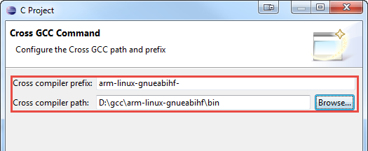

# Linux程序开发指南 - Windows交叉编译环境

- [Linux程序开发指南 - Windows交叉编译环境](#linux%e7%a8%8b%e5%ba%8f%e5%bc%80%e5%8f%91%e6%8c%87%e5%8d%97---windows%e4%ba%a4%e5%8f%89%e7%bc%96%e8%af%91%e7%8e%af%e5%a2%83)
  - [目标](#%e7%9b%ae%e6%a0%87)
  - [学习内容](#%e5%ad%a6%e4%b9%a0%e5%86%85%e5%ae%b9)
    - [安装软件](#%e5%ae%89%e8%a3%85%e8%bd%af%e4%bb%b6)
      - [Eclipse IDE for C/C++ Developers](#eclipse-ide-for-cc-developers)
      - [交叉编译工具Linaro GCC](#%e4%ba%a4%e5%8f%89%e7%bc%96%e8%af%91%e5%b7%a5%e5%85%b7linaro-gcc)
      - [WSL Windows Subsystem for Linux](#wsl-windows-subsystem-for-linux)
      - [Cygwin](#cygwin)
      - [Linux API man库](#linux-api-man%e5%ba%93)
    - [目标板准备](#%e7%9b%ae%e6%a0%87%e6%9d%bf%e5%87%86%e5%a4%87)
    - [Eclipse的交叉编译环境配置](#eclipse%e7%9a%84%e4%ba%a4%e5%8f%89%e7%bc%96%e8%af%91%e7%8e%af%e5%a2%83%e9%85%8d%e7%bd%ae)
      - [Eclipse配置](#eclipse%e9%85%8d%e7%bd%ae)
      - [创建工程](#%e5%88%9b%e5%bb%ba%e5%b7%a5%e7%a8%8b)
      - [配置GDB远程调试器](#%e9%85%8d%e7%bd%aegdb%e8%bf%9c%e7%a8%8b%e8%b0%83%e8%af%95%e5%99%a8)
    - [基于Makefile的Eclipse工程](#%e5%9f%ba%e4%ba%8emakefile%e7%9a%84eclipse%e5%b7%a5%e7%a8%8b)
      - [Makefile简介](#makefile%e7%ae%80%e4%bb%8b)
      - [安装GUN集成编译工具](#%e5%ae%89%e8%a3%85gun%e9%9b%86%e6%88%90%e7%bc%96%e8%af%91%e5%b7%a5%e5%85%b7)
      - [Makefile文件](#makefile%e6%96%87%e4%bb%b6)
      - [Eclipse工程建立](#eclipse%e5%b7%a5%e7%a8%8b%e5%bb%ba%e7%ab%8b)
  - [阶段测试](#%e9%98%b6%e6%ae%b5%e6%b5%8b%e8%af%95)
    - [练习1：完成Windows交叉编译环境的建立](#%e7%bb%83%e4%b9%a01%e5%ae%8c%e6%88%90windows%e4%ba%a4%e5%8f%89%e7%bc%96%e8%af%91%e7%8e%af%e5%a2%83%e7%9a%84%e5%bb%ba%e7%ab%8b)
    - [练习2：建立基于Makefile的工程](#%e7%bb%83%e4%b9%a02%e5%bb%ba%e7%ab%8b%e5%9f%ba%e4%ba%8emakefile%e7%9a%84%e5%b7%a5%e7%a8%8b)

## 目标

本文档简单介绍了如何在Windows系统下交叉编译、跨系统调试ARM Linux设备的方法。

嵌入式Linux系统的应用程序开发，编译器一般是gcc，一般都说是要在Linux虚拟机中进行开发和编译。本文提供了一种能够在Windows系统下编译、调试Linux应用程序的方法，可大大简化Linux软件开发环境的搭建难度，保留原开发人员的操作习惯，让Linux程序开发和开发VxWorks一样方便快捷。

## 学习内容

### 安装软件

本文所有软件，在部门NAS/FTP服务器中均有备份，但建议从网上下载更新的版本。

#### Eclipse IDE for C/C++ Developers

下载地址：<http://www.eclipse.org/downloads/packages/eclipse-ide-cc-developers/neon2>

* 选择Eclipse CDT版，专门用于C/C++开发
* Eclipse下载后，无需安装配置，直接解压即可运行，可放快捷方式到桌面

错误处理：


请安装JRE独立安装版后再试。如还报错，在桌面Eclipse快捷方式的exe路径后，添加-VM xxx参数，指定准确的JRE目录下javaw.exe路径，如：

``` bat
"D:\Program Files\eclipse\eclipse.exe" -VM "C:\Program Files\Java\jre1.8.0_161\bin\javaw.exe"
```

注意路径中有空格的，一定要将整个路径用“”双引号包起来。最后修改效果如下图：


#### 交叉编译工具Linaro GCC

下载地址：<https://releases.linaro.org/components/toolchain/binaries/7.4-2019.02/arm-linux-gnueabihf/gcc-linaro-7.4.1-2019.02-i686-mingw32_arm-linux-gnueabihf.tar.xz>

下载后，请使用7zip、WinRAR等工具解压至类似`D:\gcc`路径，不要有中文目录、空格目录，路径尽量简短。如有报错请忽略（因安装包中有Linux系统中的符号链接，Windows不支持）。解压后目录结构如下：


其中主要的几个目录位置如下：

``` bat
bin/                                            交叉编译工具目录
arm-linux-gnueabihf/libc/usr/include            Linux user-space程序头文件目录
```

**添加环境变量：**

解压文件后，将`arm-linux-gnueabihf-gcc`所在的`D:\gcc\bin`目录，添加到系统`PATH`环境变量中（系统属性-高级属性-环境变量），确保在任何位置调用`arm-linux-gnueabihf-gcc`均能成功。

**测试：**

`开始 - 运行 - cmd`，运行`arm-linux-gnueabihf-gcc --version`应有正确结果。

#### WSL Windows Subsystem for Linux

如Windows系统为Win10专业版，可以安装WSL系统，可以在Windows下运行Ubuntu虚拟机，对我们的应用层开发工作很有帮助。具体安装过程、方法见微软官方文档：

如何在Windows 10系统下开启WSL子系统

<https://docs.microsoft.com/en-us/windows/wsl/install-win10>

如何手动离线安装Ubuntu等发行版系统

<https://docs.microsoft.com/en-us/windows/wsl/install-manual>

安装后，我们再通过第二章中的方法，修改apt源，安装常用软件，就可以在Windwows中进行几乎所有的Linux软件安装、编译等工作了。


#### Cygwin

如果系统不是Win10或专业版，我们需要使用第三方的软件模拟Linux控制台。通常这个软件是Cygwin（当然也可以是MinGW的Minsys）。

下载地址：<https://cygwin.com/install.html>

根据安装向导进行在线安装，随本文档提供离线安装包
注意：

* 源选择国内的某个edu.cn源，或网上寻找合适的国内源（如163mirror）
* 软件包选择一定要包含“man”包，其他开发包根据需要可以以后追加
安装完成后，就可以在Windows环境使用Linux命令了

#### Linux API man库

在上面两个步骤我们安装WSL或者Cygwin的目的，是为了方便在Windows开发环境中随时查阅Linux、glibc的API手册。Linux提供了一套man命令，用来显示软件的使用手册、同时也可以显示API的使用说明。对Linux开发来说，这是非常重要的一个工具，远比翻书来的快速、权威。

下载地址：
<https://www.kernel.org/pub/linux/docs/man-pages/>

需要下载两个包：

* man-pages
* man-pages-posix

均可选择最新版本下载，下载后解压，将其中的man1~man7，man1p~man7p目录，复制到<br>
Cygwin安装目录下`<Cygwin_base>/usr/share/man`，如果重名则选择覆盖。<br>
或WSL根目录的usr/share/man下，如`C:\WSL.Ubuntu18.04\rootfs\usr\share\man`

完成后，打开WSL或Cygwin终端测试：

* man aio
* man pthread_mutex_lock

如果能正确打开上面两个函数对应的帮助文档，说明安装完成。以后开发中，可以随时通过man程序查看函数手册。现在你可以尝试查阅一下`printf`的帮助：`man 3 printf`，为什么加3，请上网搜索。

### 目标板准备

目标板应能正常运行Linux系统，与开发机网络连通。如使用Buildroot构建rootfs，请按以下步骤配置rootfs，增加必要的调试工具。

选中：

* `Target packages - gdb`
* `Networking applications - dropbear`，并按下图配置


* `Networking applications - gesftpserver`

完成后，重新`make`，并解压新的rootfs至`~/rootfs`。重启BBB，在shell下执行`netstat -ant | grep :22`检查22端口的Dropbear SSH Server是否已经运行。输入`gdbserver`检查是否已经安装gdb远程调试器。

Dropbear SSH Server要求必须设置密码才能使用SSH功能。输入`passwd`修改root用户的密码，改为较方便记忆的root或ceiec等字样。使用MobaXterm软件连接BBB的IP，检查SSH服务是否正常开启。

### Eclipse的交叉编译环境配置

#### Eclipse配置

点击菜单`Window- Preference`，在弹出配置框中搜索`path`，在C/C++的`Source Lookup Path`中，添加一个`File System Dir.`，路径指向`D:\gcc\arm-linux-gnueabihf\libc\usr\include`（即gcc目录下的glibc头文件目录），并选中包含子目录选项。


#### 创建工程

按如下步骤新建一个工程：

选择C/C++ - C Project


选择Cross GCC


正确设置交叉编译器前缀，如arm-linux-gnueabihf-，并正确设置交叉编译器所在的路径



工程属性中，正确选择Internal Builder


新建一个helloworld工程，检查编译是否正常


#### 配置GDB远程调试器

选中左侧工程后，点击工具栏的Debug图标，选择`Debug Configurations...`


选择`C/C++ Remote Application`后，点击新建左上角新建按钮


如是第一次调试，在弹出的对话框中，找到`Connection`下拉框右侧的`New...`按钮，创建一个新的远程SSH连接。


连接参数配置如下


完成后，下拉框选择刚才新建的SSH远程连接，同时选择待调试的程序运行路径，如程序名为appdemo，则我们输入`/run/app/appdemo`，也可以选择其他运行路径。


在Debugger选项卡中，指定gdb程序名为arm-linux-gnueabihf-gdb


完成所有设置后，启动Debug，如能正常启动debugger，说明所有环境已经配置正确，接下来可以方便的像调试VxWorks、单片机一样，交叉编译调试ARM Linux程序了。

这里有几个注意事项：

* Eclipse支持同时对多个工程进行同时调试，请注意Debugger选项中有个gdbserver的端口设置，不同的工程应设置不同的值
* 如果调试期间意外断线，可能导致ARM侧gdbserver没有退出，需要手动kill掉gdbserver进程后再重启调试

### 基于Makefile的Eclipse工程

#### Makefile简介

Linux环境下的程序员需要使用GNU make来构建和管理自己的工程，一个工程中的源文件不计数，其按类型、功能、模块分别放在若干个目录中，makefile定义了一系列的规则来指定，哪些文件需要先编译，哪些文件需要后编译，哪些文件需要重新编译，甚至于进行更复杂的功能操。makefile就像一个Shell脚本一样，其中也可以执行操作系统的命令。

同时，在电脑的IDE下也可以使用自己的Makefile管理工程，如Eclipse下可以建立自己的Makefile project工程，缩小了不同IDE环境之间的编译差异。

使用Makefile控制编译，是实现Linux程序自动编译的重要环节，除测试项目外，正式项目均应使用Makefile作为工程配置文件，不应使用Eclipse工程。

#### 安装GUN集成编译工具

Windows原生cmd终端不支持make命令，增加后就可以在电脑的shell下通过make编译工程

* 将`gnuTools`（从部门FTP下载）拷贝到电脑的盘符的根目录下，以`E:\gnuTools`为例
* 设置系统`PATH`环境变量值，分别在最前面增加`E:\gnuTools\bin;`的路径名


* 确认是否添加成功。重启或注销后打开cmd，运行`echo %PATH%`，确认`E:\gnuTools\bin;`排在第一位。运行`make`，应能提示“No targets...”的提示而不是“Command not found”

#### Makefile文件

我们提供了一份可以快速上手开发的Makefile范本，默认编译规则是自动编译工程目录及所有子目录下的所有C文件。文件有详细的注释，通过自学和研究，可以对其进行改写优化，实现更多的功能。

#### Eclipse工程建立

使用Makefile的工程，同样可以使用Eclipse进行开发。在新建工程时，选择基于Makefile的项目即可。

## 阶段测试

### 练习1：完成Windows交叉编译环境的建立

请为自己的开发电脑建立Windows系统的交叉编译调试环境。完成上文所述的所有操作，为后面的所有学习内容搭建好环境。

### 练习2：建立基于Makefile的工程

本章节中，基于Makefile的工程介绍的比较简单。更多的注意事项、参数、路径等问题，请通过练习自己摸索，掌握GNU Make工具、Windows下gnu命令等知识和概念的灵活应用。

目标：
将hello world工程使用Makefile编译，既能在Eclipse中实现编译、在线调试，也能像第三方开源软件一样通过命令行在Linux系统中直接编译。
