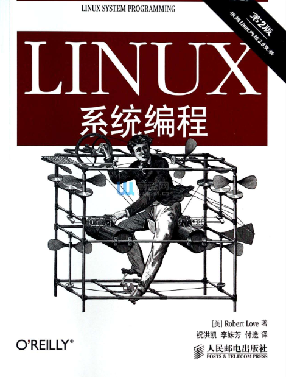

# Linux技术培训 - 应用程序开发基础

- [Linux技术培训 - 应用程序开发基础](#linux%e6%8a%80%e6%9c%af%e5%9f%b9%e8%ae%ad---%e5%ba%94%e7%94%a8%e7%a8%8b%e5%ba%8f%e5%bc%80%e5%8f%91%e5%9f%ba%e7%a1%80)
  - [目标](#%e7%9b%ae%e6%a0%87)
  - [学习内容](#%e5%ad%a6%e4%b9%a0%e5%86%85%e5%ae%b9)
    - [参考书籍](#%e5%8f%82%e8%80%83%e4%b9%a6%e7%b1%8d)
    - [开发环境](#%e5%bc%80%e5%8f%91%e7%8e%af%e5%a2%83)
    - [第1章 基本概念](#%e7%ac%ac1%e7%ab%a0-%e5%9f%ba%e6%9c%ac%e6%a6%82%e5%bf%b5)
      - [1.1 Linux系统编程基础](#11-linux%e7%b3%bb%e7%bb%9f%e7%bc%96%e7%a8%8b%e5%9f%ba%e7%a1%80)
      - [1.2 API和ABI](#12-api%e5%92%8cabi)
      - [1.3 标准](#13-%e6%a0%87%e5%87%86)
      - [1.4 Linux编程的概念](#14-linux%e7%bc%96%e7%a8%8b%e7%9a%84%e6%a6%82%e5%bf%b5)
    - [第2章 文件I/O](#%e7%ac%ac2%e7%ab%a0-%e6%96%87%e4%bb%b6io)
    - [第3章 缓冲I/O](#%e7%ac%ac3%e7%ab%a0-%e7%bc%93%e5%86%b2io)
    - [第4章 高级文件I/O](#%e7%ac%ac4%e7%ab%a0-%e9%ab%98%e7%ba%a7%e6%96%87%e4%bb%b6io)
      - [4.3 存储映射](#43-%e5%ad%98%e5%82%a8%e6%98%a0%e5%b0%84)
      - [4.6 I/O调度器](#46-io%e8%b0%83%e5%ba%a6%e5%99%a8)
    - [第5章 进程管理](#%e7%ac%ac5%e7%ab%a0-%e8%bf%9b%e7%a8%8b%e7%ae%a1%e7%90%86)
    - [第6章 高级进程管理](#%e7%ac%ac6%e7%ab%a0-%e9%ab%98%e7%ba%a7%e8%bf%9b%e7%a8%8b%e7%ae%a1%e7%90%86)
      - [普通进程（非实时进程）的调度行为](#%e6%99%ae%e9%80%9a%e8%bf%9b%e7%a8%8b%e9%9d%9e%e5%ae%9e%e6%97%b6%e8%bf%9b%e7%a8%8b%e7%9a%84%e8%b0%83%e5%ba%a6%e8%a1%8c%e4%b8%ba)
      - [实时系统](#%e5%ae%9e%e6%97%b6%e7%b3%bb%e7%bb%9f)
    - [第7章 线程](#%e7%ac%ac7%e7%ab%a0-%e7%ba%bf%e7%a8%8b)
      - [基本概念](#%e5%9f%ba%e6%9c%ac%e6%a6%82%e5%bf%b5)
      - [Pthread](#pthread)
    - [第8章 文件和目录管理](#%e7%ac%ac8%e7%ab%a0-%e6%96%87%e4%bb%b6%e5%92%8c%e7%9b%ae%e5%bd%95%e7%ae%a1%e7%90%86)
    - [第9章 内存管理](#%e7%ac%ac9%e7%ab%a0-%e5%86%85%e5%ad%98%e7%ae%a1%e7%90%86)
    - [第10章 信号](#%e7%ac%ac10%e7%ab%a0-%e4%bf%a1%e5%8f%b7)
    - [第11章 时间](#%e7%ac%ac11%e7%ab%a0-%e6%97%b6%e9%97%b4)
      - [延时被信号打断问题](#%e5%bb%b6%e6%97%b6%e8%a2%ab%e4%bf%a1%e5%8f%b7%e6%89%93%e6%96%ad%e9%97%ae%e9%a2%98)
  - [阶段测试](#%e9%98%b6%e6%ae%b5%e6%b5%8b%e8%af%95)
    - [正确使用open创建文件](#%e6%ad%a3%e7%a1%ae%e4%bd%bf%e7%94%a8open%e5%88%9b%e5%bb%ba%e6%96%87%e4%bb%b6)
    - [fork/exec练习](#forkexec%e7%bb%83%e4%b9%a0)
    - [waitpid练习](#waitpid%e7%bb%83%e4%b9%a0)
    - [普通进程优先级练习](#%e6%99%ae%e9%80%9a%e8%bf%9b%e7%a8%8b%e4%bc%98%e5%85%88%e7%ba%a7%e7%bb%83%e4%b9%a0)
    - [实时进程练习](#%e5%ae%9e%e6%97%b6%e8%bf%9b%e7%a8%8b%e7%bb%83%e4%b9%a0)
    - [线程练习](#%e7%ba%bf%e7%a8%8b%e7%bb%83%e4%b9%a0)
    - [目录基本操作](#%e7%9b%ae%e5%bd%95%e5%9f%ba%e6%9c%ac%e6%93%8d%e4%bd%9c)
    - [遍历目录练习](#%e9%81%8d%e5%8e%86%e7%9b%ae%e5%bd%95%e7%bb%83%e4%b9%a0)
    - [创建符号链接](#%e5%88%9b%e5%bb%ba%e7%ac%a6%e5%8f%b7%e9%93%be%e6%8e%a5)
    - [/dev下特殊设备](#dev%e4%b8%8b%e7%89%b9%e6%ae%8a%e8%ae%be%e5%a4%87)
    - [inotify练习](#inotify%e7%bb%83%e4%b9%a0)
    - [信号的练习](#%e4%bf%a1%e5%8f%b7%e7%9a%84%e7%bb%83%e4%b9%a0)
    - [时间练习](#%e6%97%b6%e9%97%b4%e7%bb%83%e4%b9%a0)

## 目标

本章节通过指导开发者有选择的指定书籍的内容，通过一系列编程练习，掌握Linux应用程序开发的基础技能，掌握最基本单进程、多进程程序的开发，理解和掌握文件、IO设备的操作方法。

**本章的主要内容是书本概念的抽取和划重点，同时给出一些练习作业。书本的内容作为必读项，请务必仔细学习，万万不可只看本文档就开始写代码。**

## 学习内容

### 参考书籍

本章所有的学习，都基于《Linux系统编程》这本教材，同步提供电子版（上传于部门NAS/FTP服务器）。



### 开发环境

本章节所有的练习，均可以在上一章Windows开发环境中进行。所有调用的系统API，都可以通过`man <function>`或`man 3 <function>`命令查到详细的说明。Linux和glibc的部分API至今仍在变动中，所有的API原型均以头文件及man资料为准，从网络、书籍中看到的仅供参考。

### 第1章 基本概念

#### 1.1 Linux系统编程基础

1. Linux系统编程的3大基石：系统调用、C库、C编译器
2. 理解系统调用的意义，查阅资料找到open函数对应的系统调用是什么
3. Linux的系统调用函数有多少个
4. 查阅资料，理解系统调用的原理，简单了解用户态程序调用系统时是如何陷入内核态的
5. 理解调用系统调用的开销和调用glibc中普通库函数的开销差异
6. 理解glibc库的作用
7. 编译一个hello程序，使用`readelf -d hello`查看其依赖的动态链接库，是否有glibc
8. gcc是什么

#### 1.2 API和ABI

1. 什么是API
2. 什么是ABI
3. 查阅资料理解交叉编译工具`arm-linux-gnueabihf-gcc`中gnueabihf的含义

#### 1.3 标准

1. 了解POSIX和SUS的概念
2. 重点了解我们推荐采用POSIX标准进行开发
3. C99已经完全可用

#### 1.4 Linux编程的概念

1. Linux系统文件和文件系统的概念
2. Linux系统一切皆文件，普通文件、链接、字符设备、管道等都是文件形式
3. 进程是什么，线程是什么，简单概要了解
4. 用户和组，大概了解，并在Ubuntu系统中做测试，嵌入式我们暂不涉及，均为root
5. 权限，尤其是可执行权限，是后面开发经常碰到的坑；777、755、644分别是什么意思
6. 信号是Linux系统很重要的、也很古老的进程间交互的方式，有很多坑要踩
7. Linux的错误码有一套很好的体系，开发程序要善用`errno`和`perror()`

### 第2章 文件I/O

本章主要介绍了基本的文件I/O接口：`open()`、`read()`、`write()`、`close()`、`ioctl()`的用法。这部分的概念和使用基本和VxWorks等系统是一致的。

注意点：

1. `open()`函数有两种原型，最后一个参数`mode_t mode`在Linux里是有具体含义的，表示权限标志，可以设置文件权限；而VxWorks的文件系统均没有权限控制的功能，这一项无意义
2. 对`read()`有支持阻塞模式（默认）和非阻塞模式，通过`open()`时传入`O_NONBLOCK`标识来设置
3. Linux的文件系统有强大的缓存管理能力，一定要记住`write()`完成不代表数据已经写到磁盘，很可能还在内存，立刻断电是会丢数据的；文件系统可以设置`sync`模式或手动调用`sync()`来强制`落盘`（这个词汇在Linux里很常见）
4. 文件的多路复用可以采用`select()`也可以采用`poll()`，新系统还有`epoll`等API，在Linux的高性能并发编程中，关于`poll`、`epoll`的讨论和介绍非常多，是个重点
5. `select()`的一个另类却通用的做法是实现一个可跨系统移植的延时函数
6. 2.11内核内幕部分，简单看即可，关键记住cache是深入Linux骨髓的东西，也会碰到各种坑

### 第3章 缓冲I/O

本章介绍了glibc对标准文件I/O进行封装后的缓冲I/O，主要就是`fopen()`、`fread()`等接口，这部分内容与其他系统是一致的，可以简单学习，了解一下。一般在一些文本文件的操作中，缓冲I/O接口比文件I/O接口更加方便实用。

### 第4章 高级文件I/O

本章难度较高，我们选择其中几个小点来学习：

#### 4.3 存储映射

学习掌握将一个文件直接映射到一片内存的`骚操作`，这个特性利用了系统页面缓存，在某些场合特别方便。

我们后面会介绍的共享内存、用户态直接访问物理内存等高级功能，都会利用这个`mmap()`，目前我们只需要掌握最简单的打开文件，对其进行mmap映射的基本用法即可。

#### 4.6 I/O调度器

我们要理解Linux设置I/O调度器的原因，I/O调度器在其他硬实时系统中试不存在的，调度器的好处是什么。理解概念， 知道有I/O调度器的概念，知道我们可以通过设置选择一种适合自己应用的调度器，在碰到奇怪问题的时候可以想到系统还有I/O调度器可能导致一些不符合预期的现象。

### 第5章 进程管理

Linux应用程序都是一个个进程，所以本章节很重要，其中有大量的概念和VxWorks有所区别，需要反复阅读和测试。

* 理解通过shell启动一个程序，其父进程是谁
* 如何用程序获取自己的PID、PPID
* 如何用程序启动一个新进程，即`fork/exec`系列函数的使用，重点
* 理解`execl()`、`execlp()`等函数的区别
* `fork`和`vfork`应该优选哪个
* 进程退出后，`wait()`和`waitpid()`的作用
* 避免出现僵尸进程是Linux进程管理中的重要工作，开发时要注意子进程资源的回收
* 通过`wait()`/`waitpid()`获取进程结束后的返回值
* `system()`与`fork/exec`的区别，`system()`的缺点、方便之处
* 对于用户组、会话相关内容(5.6、5.7），可以先忽略，嵌入式Linux暂不涉及多用户及进程组
* 守护进程的概念，用途

进程和子进程的继承性

* 子进程会复制父进程的大多数参数和状态，包括内存、堆栈、文件描述符、信号处理函数等
* 子进程不会继承父进程的pid、统计信息、挂起的信号、文件锁

### 第6章 高级进程管理

对我们嵌入式Linux，对RTOS的熟悉程度比Linux更高，高级进程管理中关于进程优先级的概念，与传统RTOS有所区别。同时优先级又分抢占式优先级和nice优先级，进一步复杂化了Linux的进程调度概念。

这一章节应作为重点章节，反复阅读，反复练习，争取做到精通。这对于编写有实时性要求的应用程序来说非常重要。

#### 普通进程（非实时进程）的调度行为

* 我们要了解Linux内核当前的默认调度器是CFS
* 基于CFS的应用程序，如何开发合理的应用，“表现友好”
* `nice`值的概念，+20优先级高还是-20优先级高
* 了解多处理器环境中，如何设置处理器亲和力（概念性）

#### 实时系统

* 硬实时的概念
* Linux实时性如何
* 进入Linux内核目录，`menuconfig`找到并观察当前Linux内核的调度策略，是否支持RT-Linux
* 理解抢占式调度的概念，理解FIFO、Round-Robin的概念
* 静态优先级0-99，多少优先级更高
* 调度策略有`SCHED_OTHER`、`SCHED_FIFO`、`SCHED_RR`三种
* 掌握如何设置进程为实时进程，如何设置调度策略和优先级
* 掌握使用`chrt`命令在命令行中调整进程优先级和调度策略

额外重点：

* 实时进程可以轻易把系统搞死，有哪些注意要点
* 网上搜索用于评估系统实时性的工具，对比实时系统和非实时系统的差异
* 从TI官网下载Linux内核的两个版本：普通版本、RT版本，通过`menuconfig`和测试工具，对比理解RT-Linux的特性

资源限制部分，可以暂时简单略过。

### 第7章 线程

线程是本书另一个重要的概念，与进程、高级进程管理一样，需要重点研究学习。

#### 基本概念

* 理解多线程的好处、用途，与多进程的差异
* 线程之间的内存是否可见，资源是否共享
* 线程模型理解有点复杂，可以忽略
* 线程模式部分，非常重要，这是一个变成思想和范式，尤其是事件驱动、线程池等概念，在我们未来新一代的Linux程序架构中有广泛的应用
* 线程带来的并发问题，同步与互斥的问题

#### Pthread

Linux有两种线程实现，目前主要使用NPTL，了解就好。

我们主要学习`pthread_`系列的API，并掌握线程的创建、退出、监控、优先级调度设置等操作。

* 调用pthread系列函数，编译时要增加-pthread参数
* 线程的创建方法
* 线程的退出，自杀和被杀
* 线程的join、detach与僵尸进程的关系
* 获取线程退出的返回值
* 基于pthread_mutex的互斥量使用

### 第8章 文件和目录管理

本章的内容非常实用，涉及到Linux文件系统的操作，在嵌入式设备中经常需要对存储的文件进行操作、遍历、移动，并可能会执行一些磁盘控制类的操作。

本章内概念性的内容较少，都是实用的函数介绍，请逐一对照书本进行实际练习。

8.7节 监视文件事件，是VxWorks系统很少涉及的部分。inotify可以实现一个高级的文件变动通知，对于一些需要时刻监视文件变化的场合（如配置文件变化），可以让程序更加合理优雅。

注：文件的扩展属性嵌入式Linux不涉及

### 第9章 内存管理

本章内容稍微不那么重要，需要掌握的知识点如下：

* 内存段的概念：text、stack、data、heap、bss等
* 动态内存分配的方法：malloc、calloc、realloc、free
* mmap的另一个用法，匿名映射，以及malloc函数如何自动选择从heap申请内存还是匿名映射
* 内存锁定部分无需关注，嵌入式系统没有swap机制
* 最后一节OOM请关注，Linux开发中如遇到内存过度占用，自身或一个不相关的进程可能被系统强制杀死来释放内存

### 第10章 信号

信号是Linux系统的一个重要机制，相比于其他系统，信号在Linux中的地位非常重要，我们也要对信号有一定的认识和理解。

* 理解我们在shell中用`Ctrl+X`、`kill`强制杀死进程的原理
* 熟悉常见的信号：SIGABRT、SIGALRM、SIGCHLD、SIGHUP、SIGKILL、SIGTERM等等
* 理解信号默认操作的意义，并尝试使用`signal()`重新定义信号处理函数
* 使用`kill()`来发送指定的信号给特定的进程
* 信号处理函数是一个“软中断”，在中断中的调用函数要精简、可重入
* 信号集部分可以略过
* 除了`signal()`，我们更多的要掌握`sigaction()`的使用，尤其是掌握通过`siginfo_t`给信号处理函数传递参数的方法
* 上网搜索，了解可靠信号与不可靠信号的区别，可靠信号`SIGRTMIN`~`SIGRTMAX`是后期扩展的一批信号，支持排队，不会丢失遗漏
* 上网搜索，了解在一个多线程程序中，信号的行为是很特别的，非常容易引起一些不可预见的错误，主要是信号究竟发给了哪个线程，有时候是随机的，这一点需要额外阅读一些资料和文章来理解

### 第11章 时间

本章节也是一个重点，将介绍Linux系统中与时间、延时相关的各种操作。

时间的读取和设置

* 理解多种POSIX时钟的含义
  * `CLOCK_REALTIME`
  * `CLOCK_MONOTONIC`
  * `CLOCK_MONOTONIC_RAW`
  * `CLOCK_PROCESS_CPUTIME_ID`
  * `CLOCK_THREAD_CPUTIME_ID`
* 学习和掌握Linux系统中多种获取时间的方法，并从效率、精度、分辨率等角度进行对比
  * `time()`
  * `gettimeofday()`
  * `clock_gettime()`
* 学习设置时间的多种方法：`clock_settime()`、`adjtime()`

延时

* 掌握最基本的几种延时的方法，并对比他们的差异、限制、延时精度
  * `sleep()`
  * `usleep()`
  * `nanosleep()`
  * `clock_nanosleep()`
* 分析延时期间修改系统时间可能产生的影响
* 掌握使用`clock_nanosleep()`实现校时无关延时函数的方法
* 掌握使用`select()`实现一个可移植的高精度延时函数的方法
* 定时器`alarm()`、`timer_`系列函数的使用

关于系统实时性与定时器精度的关系

我们知道操作系统的调度核心离不开定时器，Linux系统在2.6之后引入了高精度定时器的概念hrtimer，请上网搜索相关文章，大概了解高精度定时器与以前Linux内核的节拍定时器的区别。理解为什么现在的Linux内核可以提供ns级精度的定时服务。

请做测试程序，验证我们ns级定时器的定时精度，是否真的能达到很高的程度？试着写一个1ms运行一次的程序，在1ms任务里读取系统时间，检测误差。当系统其它负荷很高时（可以尝试写一个很占用CPU资源的命令），1ms的任务实时性是否收到了影响？

一个占用cpu的命令例子

``` sh
for i in `seq 1 $(cat /proc/cpuinfo |grep "physical id" |wc -l)`; do dd if=/dev/zero of=/dev/null & done
```

如果我们把内核更换为RT-Linux版本，1ms的走时精度是否有所提高？

问题：

在RT-Linux系统中，如何实现一个非常精确的1ms定时任务？

* 定时器
* `clock_nanosleep()`
* ？

请多尝试一些延时函数的方法，看看谁可以实现更高的定时精度？<br>
提示：可以多在RT-Linux官网上看看有什么教程和范例，上面有一个非常好的例子，为大家展示了`clock_nanosleep()`的灵活性

#### 延时被信号打断问题

Linux中有大量的阻塞函数（最典型的就是延时），在阻塞期间如果有信号（`signal`）产生，当前阻塞的函数会提前结束，并返回错误码`EINTR`。这是Linux系统应用程序开发中的一个需要特别关注的点。通常有几种处理措施：

* 线程屏蔽信号
* 检测函数返回值及errno，在遇到`EINTR`后重新启动延时，完成剩余的延时时间

信号是Linux应用程序一定会遇到的情况，必须要处理，请网上搜索相关资料，解决上述问题。

## 阶段测试

### 正确使用open创建文件

编写测试程序，在`/root`目录下创建多个文本文件，内容随意，权限分别为：

* -rwx------
* -rwxr--r--
* -rw-r--r--
* -rwxr-xr-x

### fork/exec练习

编写程序，使用`fork/execl`调用ping执行`ping 192.168.2.2`的命令。分别使用不同的`exec`系列函数完成调用。并理解其中参数传递与`main`函数中`argv[...]`之间的关系。

请做好`exec`函数返回错误后的错误码检测工作，尝试认为制造文件不存在等问题，看错误码是否正确反映问题。

同时请加强对`fork`函数后父进程、子进程的区分和理解，在程序中`printf`清晰说明当前运行环境是父进程还是子进程。

**TIPS**<br>
`ping`命令有`-c`参数可以指定`ping`测试的次数，默认不会停止

### waitpid练习

1. 在上节`fork/exec`练习中，尝试反复调用`ping`命令制造出大量的僵尸进程。
2. 实验通过`wait()`、`waitpid()`方法回收子进程
3. 尝试通过`wait()`、`waitpid()`方法获取ping命令的返回值，封装ping函数返回网络通断情况，`0: 网络正常`、`-1：网络异常`

### 普通进程优先级练习

1. 编写一个程序，设置自己的`nice`优先级为10
2. 通过`nice`命令修改该进程的优先级
3. 尝试写一个死循环，通过降低`nice`值看能否让系统不那么卡

### 实时进程练习

1. 分别按相同的方法编译普通Linux内核与RT-Linux内核（TI SDK都有提供）
2. 运行`cyclictest`对比两种系统的实时性差异
3. 编写程序，将自己设置为实时进程，并设置实时优先级
4. 使用`chrt`动态查看、修改该进程的调度策略、优先级

### 线程练习

1. 编写一个多线程的程序
2. 主线程监控子线程的运行
3. 当子线程完成工作后，带返回值退出，主线程应捕捉到子线程退出事件，并将返回值获取并打印出来
4. 设置一个全局变量，被所有线程读取，设置合理的互斥量机制
5. 当主线程不`join`子线程时，子线程退出时会发生什么？通过`ps`命令观察

### 目录基本操作

一个应用程序要应该要做到可以放置在任何路径下运行，可能这需要一些获取当前文件路径、获取当前目录的操作。
请编写程序，获取应用程序自身的：**程序所在路径**、**当前工作目录**，并仔细体会这两者的差异。

### 遍历目录练习

创建一个具有两级子目录的复杂目录结构，编写代码遍历所有目录，并列出每一级目录下的文件。

### 创建符号链接

编写测试程序，在`/root`目录下创建一个名为`link-to-busybox`的符号链接，指向系统busybox主程序

### /dev下特殊设备

1. 尝试使用`/dev/random`、`/dev/urandom`设备获取硬件随机数
2. 尝试向`/dev/null`写数据，观察效果
3. 尝试从`/dev/zero`读数据，观察效果

### inotify练习

1. 模拟一个参数配置进程和一个参数消费者进程
2. 使用inotify监控参数配置文件
3. 当参数变化时，消费者进程可以立刻响应

### 信号的练习

1. 编写一个能捕捉`Ctrl-X`的测试程序，启动后禁止被Shell的`Ctrl-X`杀死
2. 想办法用其他方法杀死上面的程序
3. 设计一个使用`SIGUSR1`信号的测试程序，使用`sigaction()`注册信号处理函数，并使用`siginfo_t`向信号处理函数传入一个变量

### 时间练习

1. 编写一个设置时间的程序，使用adjtime设置一个时间，想办法观察时钟缓慢调整的过程
2. 1ms定时程序开发：
   1. 要求使用多种延时函数，分别实现固定1ms间隔执行任务
   2. 在1ms任务里记录每次执行任务的间隔，评估1ms的精度
   3. 对比普通Linux内核与RT-Linux内核在相同程序下的延时精度差异
   4. 学习RT-Linux官网文章、范例，编写一个标准的1ms固定周期定时程序
3. 设置一个2秒延时函数，和捕捉`Ctrl-C`信号并打印消息，想办法产生信号打断延时函数的情景，并优化程序实现更可靠的、不会被信号打断的延时程序
