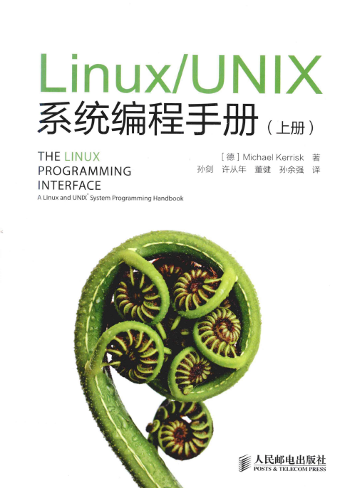

# Linux程序开发指南 - 进程间通讯IPC

- [Linux程序开发指南 - 进程间通讯IPC](#linux%e7%a8%8b%e5%ba%8f%e5%bc%80%e5%8f%91%e6%8c%87%e5%8d%97---%e8%bf%9b%e7%a8%8b%e9%97%b4%e9%80%9a%e8%ae%afipc)
  - [目标](#%e7%9b%ae%e6%a0%87)
  - [学习内容](#%e5%ad%a6%e4%b9%a0%e5%86%85%e5%ae%b9)
    - [参考书籍](#%e5%8f%82%e8%80%83%e4%b9%a6%e7%b1%8d)
    - [POSIX与SystemV](#posix%e4%b8%8esystemv)
    - [资源互斥：POSIX信号量](#%e8%b5%84%e6%ba%90%e4%ba%92%e6%96%a5posix%e4%bf%a1%e5%8f%b7%e9%87%8f)
      - [POSIX互斥量练习](#posix%e4%ba%92%e6%96%a5%e9%87%8f%e7%bb%83%e4%b9%a0)
    - [资源互斥：线程锁 pthread_mutex](#%e8%b5%84%e6%ba%90%e4%ba%92%e6%96%a5%e7%ba%bf%e7%a8%8b%e9%94%81-pthreadmutex)
    - [进程同步：POSIX信号量](#%e8%bf%9b%e7%a8%8b%e5%90%8c%e6%ad%a5posix%e4%bf%a1%e5%8f%b7%e9%87%8f)
      - [POSIX信号量练习](#posix%e4%bf%a1%e5%8f%b7%e9%87%8f%e7%bb%83%e4%b9%a0)
    - [进程同步：条件变量](#%e8%bf%9b%e7%a8%8b%e5%90%8c%e6%ad%a5%e6%9d%a1%e4%bb%b6%e5%8f%98%e9%87%8f)
    - [进程同步：System V信号量](#%e8%bf%9b%e7%a8%8b%e5%90%8c%e6%ad%a5system-v%e4%bf%a1%e5%8f%b7%e9%87%8f)
    - [消息队列：POSIX消息队列](#%e6%b6%88%e6%81%af%e9%98%9f%e5%88%97posix%e6%b6%88%e6%81%af%e9%98%9f%e5%88%97)
      - [消息队列练习](#%e6%b6%88%e6%81%af%e9%98%9f%e5%88%97%e7%bb%83%e4%b9%a0)
    - [消息队列：Socket](#%e6%b6%88%e6%81%af%e9%98%9f%e5%88%97socket)
    - [共享内存：POSIX Shm](#%e5%85%b1%e4%ba%ab%e5%86%85%e5%ad%98posix-shm)
      - [共享内存练习](#%e5%85%b1%e4%ba%ab%e5%86%85%e5%ad%98%e7%bb%83%e4%b9%a0)

## 目标

本章节专门针对Linux系统中常用的几种进程间通讯的方式进行了讲解，每个通讯机制都有配套的练习，最后还提供OSAL库源码供参考和讨论。

## 学习内容

### 参考书籍

本章所有的学习，都基于《Linux/UNIX系统编程手册》上下这本教材，同步提供电子版（上传于部门NAS/FTP服务器）。



本书作为Linux系统编程的进阶资料，内容丰富详细，非常适合开发日常作为工具书查阅。其中对于进程间通讯部分的介绍，是上一章我们使用的《Linux系统编程》没有的。本书同时介绍了SystemV和POSIX两种风格的进程间通讯的API。

### POSIX与SystemV

Linux系统实现了两套截然不同、而有各自成体系的IPC机制：SystemV和POSIX。这两种接口均能实现完整的信号量、消息、共享内存的操作。对于Linux下新的应用，考虑到效率、VxWorks可移植性、兼容性等情况，一般推荐优选POSIX接口作为应用程序的主要的IPC接口。当然，也有一些情况下，POSIX标准的IPC机制无法达到我们的目的，这时候我们还是需要尝试其他的方案了（如SystemV API、Socket）。

### 资源互斥：POSIX信号量

学习章节：<br>
第53章 P895 POSIX信号量 **全部内容**

要点如下：

* POSIX信号量在初始化时，可以选择信号初值，如初值`=0`一般用于进程间的同步，如初值`>0`一般用于共享资源的互斥访问
* POSIX信号量允许创建匿名信号量和命名信号量
* 其中命名信号量适用于进程之间的同步，只要两个进程使用同样的名称`sem_open()`即可共享该信号量，实现跨进程的信号同步
* 同一个进程的多线程之间，使用`sem_init()`进行初始化，即可获取一个供线程之间使用的匿名信号量，通过共用申请到的`sem_t`对象实现互斥和同步
* 当POSIX信号量用于竞争资源的互斥访问控制时（即作为互斥量mutex），并不具备“谁加锁、谁解锁”的机制，A进程加的锁可以由B进程进行解锁，在使用上过于灵活反而有一定的风险。同时其信号量只有计数型信号量，允许重复加解锁，这一点也是要引起注意
* `fork`出的多线程，在`fork`前申请匿名信号，在派生出的多个进程中是无法共享信号量的。因为`fork`出来的两个进程，地址空间独立、变量对象均为复制而非引用，两个进程之间并不共享同一个`sem_t`对象。

#### POSIX互斥量练习

1. 实现一个多线程程序，申请一个匿名信号量，并对一块malloc出来的内存进行互斥量的保护

### 资源互斥：线程锁 pthread_mutex

学习章节：<br>
第30章 P521 线程：线程同步 30.1 保护对共享变量的访问-互斥量

要点如下：

线程锁是POSIX thread库（pthread）中用于解决线程间共享资源互斥访问而设计的，其解决了上文中POSIX信号量用于互斥mutex时的局限性，是单纯为了互斥锁而设计的。互斥锁所谓特殊，它要求只有加锁者才能解锁，其他使用者只能等；同时没有资源数量的参数，只有`0`和`1`两个值表示锁定/解锁两个状态。

POSIX标准定义的`pthread_mutex_t`互斥锁，属于线程锁，字面上只能在线程之间使用，但实际上也能用于多线程，只需要将`pthread_mutex_t`对象放置/创建在多线程均能访问的共享内存区域，并同时打开`PTHREAD_PROCESS_SHARED`属性。

基于以上操作，实现了`pthread_mutex`的跨进程共享问题，我们在多线程、多进程的环境中，在保护共享资源的场合均推荐使用`pthread_mutex_t`线程锁。

一个典型的用法为：
在一个设备中，需要用共享内存将装置状态、实时数据等提供给所有的进程使用，此时我们可以定义如此的数据结构，将共享数据+互斥锁定义到同一片共享内存中：

``` C
typedef struct {
    pthread_mutex_t lock;
    … // user defined data
} SHM_REALTIME;

SHM_REALTIME *shm_rt_data;
shm_open(shm_rt_data, xxxxxx);  //仅为示例，表示创建了共享内存
ftruncate(xxx);
mmap(xxxx);
// 共享内存创建完成

// 通过下面的方法初始化mutex
pthread_mutexattr_t attr;
pthread_mutexattr_init(&attr);
pthread_mutexattr_setpshared(&attr, PTHREAD_PROCESS_SHARED);
pthread_mutex_init(&shm_rt_data->lock, &attr);

// 如此我们可以轻松的使用集成在共享资源内的互斥量来保护当前的资源了：
pthread_mutex_lock(&shm_rt_data->lock);
shm_rt_data->xxx = xxx;
pthread_mutex_unlock(&shm_rt_data->lock);
```

使用建议

对于用户态程序中共享内存资源的互斥，首选`pthread_mutex`，因为其实现了谁加锁谁解锁的机制，并能跨进程使用。对于其他无法应用`pthread_mutex`的场合，则推荐使用命名和非命名信号量。

### 进程同步：POSIX信号量

学习章节：<br>
第53章 P895 POSIX信号量

上文已经介绍过POSIX信号量`sem_t`作为互斥量的使用，对于进程间同步的应用，采用POSIX信号量是一个不错的选择。

POSIX信号量是进程间、线程间进行同步的首选机制，其使用方法与VxWorks下非常类似，程序容易跨系统移植。当POSIX信号量以初值0进行创建时，即可作为信号量使用。具体使用比较简单，就是`sem_post()`、`sem_wait()`。与上文互斥中提到的类似，用作同步的信号量也有命名、非命名两种形式，可以在进程间、进程内使用。

信号量超时的问题：

为了实现软件喂狗（Keepalive）的操作，通常不允许信号量无限期等待，需要一个超时退出机制。<br>
POSIX信号量的wait操作支持超时退出，使用`sem_timedwait()`函数可以输入一个基于1970年绝对时间的`struct timespec`时间，在该时间到来时函数返回。但因其基于绝对时间，在修改系统时间的时刻其超时时间是不可预知的，也许立即返回，也许N年都不会超时。

POSIX信号量自身并没有什么好办法来解决上述问题，只能在外部使用其他手段，有一种方法是额外利用一个timer进行超时控制，在超时回调函数中，利用POSIX信号量谁都可以post的特性强制将阻塞超时的信号释放，同时置位一个标志用于区分成功wait还是超时强制wait。
示例程序`osal-semaphore.c`展示了一种利用POSIX sem+timer封装的、带相对时间超时机制的信号量实现，可以参考学习。

#### POSIX信号量练习

1. 实现两个进程，使用`sem_open()`打开同一个命名信号量，并实现进程A每隔2秒向进程B释放一次信号量，进程B收到信号后打印一条信息的功能。
2. 使用`sem_timedwait()`实现信号量等待超时功能

### 进程同步：条件变量

学习章节：<br>
第30章 P528 线程：线程同步 30.2 通知状态的改变-条件变量

条件变量是pthread下的线程同步机制，其使用有点麻烦，需要配合`pthread_mutex`共同使用，且VxWorks下没有对应的原生同步机制与之对应，跨系统的移植比较麻烦。`pthread_cond`条件变量同样是POSIX标准下的IPC机制，其timed系列超时机制仍然采用绝对时间，也同样无法解决POSIX timedwait在校时后可能无法超时的问题。因没有特别的好处，这里暂不推荐使用。

### 进程同步：System V信号量

学习章节：<br>
第47章 P792 System V信号量

System V IPC机制的确被设计得过于复杂，但有时候却刚好能解决问题。
正因为上面POSIX标准的两种实现同步的机制都存在超时时间非相对时间的问题，我们也可以尝试使用System V信号量来解决。
与POSIX信号量相比，System V信号量因为每次都需要陷入内核，效率上会低一些。

### 消息队列：POSIX消息队列

学习章节：<br>
第52章 P874 POSIX消息队列 52.6暂不看

POSIX消息队列（也称为mqueue、mq）实现了一套比较完整且好用的进程间消息传递机制，基本能满足我们的使用。大开消息队列的操作类似打开文件，队列双方只要打开同一个“文件”即可以互相传递信息。

消息的接收超时：

`mq_receive()`支持完全阻塞和非阻塞模式，不带超时时间。`mq_timedreceive()`支持带超时时间的接收消息，与VxWorks的msgQReceive相似。和上文中的POSIX信号量一样，`mq_timedreceive()`的超时时间也定义成了绝对时间abs_timeout，使用时需要先`clock_gettime()`读时间，再加上一个超时相对时间后，传递给`mq_timedreceive()`函数。<br>
问题是，当我们向前向后调整时间时，可能会使超时时间不可靠，向未来调整时间会缩短超时时间，这个问题不大；而向过去调整时间，则会让超时时间延长。对于PMC装置在VxWorks中的常用套路，线程在接收消息处理完成后以及在接收消息超时时喂狗，如果用`mq_timedreceive()`方法移植到Linux，可能会出现喂狗超时的问题。<br>
规避对策：<br>
POSIX消息队列描述符`mqd_t`被设计成了类似文件描述符的形式，并接入到了Linux虚拟文件系统中的inode，从而可以支持Linux中一些通用的文件描述符的操作，所以其也支持异步IO如`select()`、`poll()`、`epoll()`监控fd的方法，而`select()`采用相对时间作为超时控制，刚好可以解决等待消息时使用相对时间进行超时控制的功能。示例程序如下：

``` C
/* 这里我们利用Linux系统POSIX IPC支持select/poll的特性
    * 使用select对mq的文件描述符进行监视，利用select自身的超时机制实现相对时间的超时控制
    * 该超时机制完全由select实现，故不受POSIX mqueue的实现影响，能使用相对时间进行超时控制
    * 使用本例程，等待消息期间无论如何修改系统时间，都不影响select按时退出
    * 从而，我们依然可以用VxWorks下常用的等待消息超时后喂狗的方法来判断任务有没有异常
    */
fd_set fds;
FD_ZERO(&fds);
FD_SET(mqd, &fds);
struct timeval tv;
tv.tv_sec = 5;
tv.tv_usec = 0;

ret = select(mqd + 1, &fds, NULL, NULL, &tv);
if (ret == -1)
{
    printf("select error.\n");
}
else if (ret)
{
    if (FD_ISSET(mqd, &fds))
    {
        ret = mq_receive(mqd, mymsg, MQ_SIZE, &prio);
    }
}
else
{
    printf("select timeout.\n");
}
```

消息队列的效率性能问题

和VxWorks系统一样，消息队列的发送和接收均需要通过内核，消息内容在send和receive侧会分别复制一次。当消息大、发送频繁时，性能很差。<br>
此时建议使用共享内存+短消息或信号量的方式来实现相关功能，具体的做法，在VxWorks的bio上有典型的用法，创建一组队列、一个保护队列的互斥锁、一个通知接收侧的消息队列或信号量即可。通过消息队列只传递关于消息内容的描述结构体，而实际数据（payload）则通过共享内存来共享，仅使用一个互斥量来保护这段共享内存。

#### 消息队列练习

1. 创建两个进程，分别负责消息的发送和接收
2. 使用mqueue实现基本的消息收发
3. 捕获自定义信号，并测试外部信号打断消息接收后的行为，考虑优化代码提高可靠性
4. 使用mqueue自带的方法实现接收消息侧的超时功能，并在shell中使用`date`命令进行校时测试
5. 使用`select()`改造接收侧代码，并重新测试校时影响

### 消息队列：Socket

Socket除了用作网络通信外，在主机进程间通信也有广泛的应用。主要好处在于跨系统移植性较高，几乎所有现代操作系统都有这个机制，且用法几乎一样。

Linux中支持UNIX Domain Socket，是一套专门用于进程间通信的Socket接口，通过调用`socket()`函数是传入`AF_UNIX`来打开，而IP4则使用`AF_INET`。<br>
与POSIX消息队列相比，UNIX Domain Socket具有全双工、API接口丰富、跨OS支持度高等特点，被广大的开源软件使用。

其使用方法和标准网络编程非常相似，几乎兼容。对Socket编程，不在本次培训的范围内，故这部分我们只简单介绍，暂不深入。

### 共享内存：POSIX Shm

学习章节：<br>
第54章 P909 POSIX共享内存

共享内存使用方法比较简单，通过一系列的shm_open, ftruncate, mmap操作，即可申请到一片共享内存。另一个进程通过同样的方法，可以打开同一片内存。所有的操作都有一套固定的套路，使用起来没什么特别的。

共享内存是进程间共享大块数据的最高效方法，实际仅通过内存映射实现了资源的共享，不会产生额外的拷贝。但要注意一点，共享内存机制本身不提供任何互斥的功能，需要配合线程锁等实现共享资源的保护。

``` C
/*
 * init shm for dev_data
 */
int init_shm(char *shm_name)
{
    int fd = -1;
    int ret;

    if (shm_name == NULL)
        return(-1);

    fd = shm_open(shm_name, O_RDWR | O_CREAT, 0777);
    if (fd == -1)
    {
        printf("shm_open " SHM_DEV_DATA_NAME " failed!\n\r");
        goto FAIL_OUT;
    }

    ret = ftruncate(fd, sizeof(t_shm_dev_data));
    if (ret == -1)
    {
        printf("ftruncate failed!\r\n");
        goto FAIL_OUT;
    }

    dev_data = mmap(NULL, sizeof(t_shm_dev_data), PROT_READ | PROT_WRITE,                   MAP_SHARED, fd, SEEK_SET);
    if (dev_data == NULL)
    {
        printf("mmap failed\n\r");
        goto FAIL_OUT;
    }

    return(0);

FAIL_OUT:
    if (fd != -1)
    {
        shm_unlink(shm_name);
    }
    if (dev_data != NULL)
    {
        munmap(dev_data, sizeof(t_shm_dev_data));
    }

    return(-1);
}
```

#### 共享内存练习

1. 编写一个多进程程序，申请和打开共享内存，测试效果
2. 通过命令行观察`/dev/shm/`目录下是什么样的，是否能通过命令行读到共享内容
